# Miro Canvas

Miro sticky notes, shapes, drawings and comments beside your Obsidian notes.

The plugin adds tools to native Canvas. Sketch a plan with sticky notes,
connect tasks with arrows and bring in details from your vault. Notes, links
and attachments stay part of Obsidian. Choose the tools, styling and panel
layout that suit you.

[Русский](README.ru.md) · [Install](#installing) · [Get started](#getting-started)

## Contents

- [Getting started](#getting-started)
- [Obsidian notes and links](#obsidian-notes-and-links)
- [Cards, shapes and frames](#cards-shapes-and-frames)
- [Formatting](#formatting)
- [Arrows and drawing](#arrows-and-drawing)
- [Comments and locking](#comments-and-locking)
- [Search and navigation](#search-and-navigation)
- [Make it yours](#make-it-yours)
- [Phone and tablet](#phone-and-tablet)
- [Export](#export)
- [Bring boards from Miro and other plugins](#bring-boards-from-miro-and-other-plugins)
- [Files, network use and limitations](#files-network-use-and-limitations)
- [Installing](#installing)
- [Reference, plans and development](#reference-plans-and-development)

Short GIFs expand beside the relevant instructions. Open a recording at full
size if its smaller controls are difficult to see.

## Getting started

1. [Install](#installing) and enable Miro Canvas.
2. Open an existing `.canvas` file or create a new board in Obsidian.
3. Choose the sticky note tool and click an empty place on the board.
4. Write a quick thought. Add a note from your vault and connect them with an arrow.
5. Select an item to change its colour, font or shape.

Continue with a small plan:

| Try | What you get |
| --- | --- |
| [Connect two sticky notes](#arrows-and-drawing) | A plan whose arrows follow the cards |
| [Add a note or file](#obsidian-notes-and-links) | Your Obsidian material beside the plan |
| [Reply and resolve a comment](#comments-and-locking) | An open discussion and a completed thread |
| [Export the plan](#export) | A PDF or PowerPoint saved in your vault |

The welcome board has the same route through sections **1 → 2 → 6 → 8**.
Its other sections remain available whenever you need them.

Use these tool shortcuts while you are not editing text:

| Key | Tool |
| --- | --- |
| V | Select |
| T | Text |
| N | Sticky note |
| S | Shape |
| P | Pen and drawing tools |
| L | Lines and arrows |
| C | Comment |
| F | Frame |

**Escape** clears the current tool and selection. Double-clicking or
double-tapping empty board does the same. Undo with **Ctrl + Z**, or **Cmd + Z**
on Mac. Code blocks, tables and website links are under **+** at the end of the toolbar.

The first-run prompt offers a **welcome board** with twelve practical sections,
real Obsidian files and room to experiment. It opens at the introduction,
or at the first steps on a narrow screen;
use the minimap to visit the other sections. The board and sample files are
created in your vault and remain available to edit.

Explore the welcome board

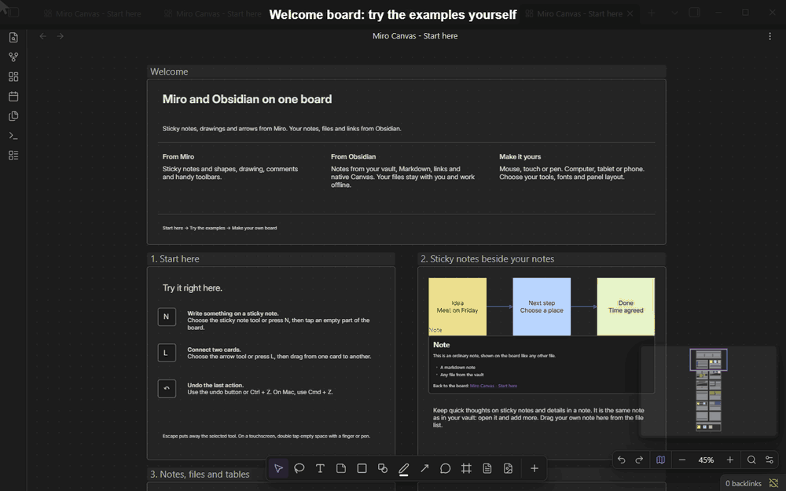

Use **Settings → Miro Canvas → Getting started → Create the welcome board**
to create a fresh copy of the current guide. An occupied name gets a numbered
suffix, preserving your previous board and edits. The guide includes open and
resolved comments, a movable frame, code/formula samples and actual exported
PDF/PowerPoint files. See the [feature-to-example audit](docs/welcome-board-coverage.md).
The new board is named **Miro Canvas - Start here.canvas**. Older welcome
boards and existing examples are preserved.

## Obsidian notes and links

Drag a note from the file list onto the board, or use the note button on the
toolbar. It is the same file: changes to the original appear on the board too.

Add a note from your vault

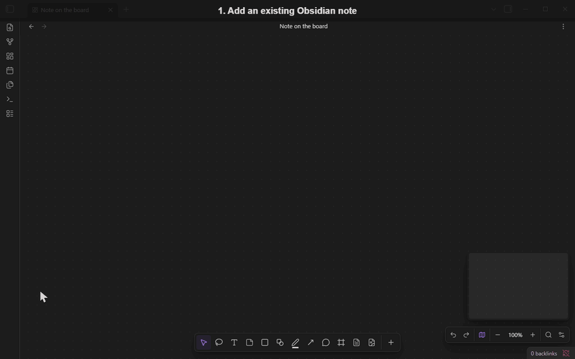

Text cards support Obsidian links and embeds:

| Syntax | Result |
| --- | --- |
| `[[Project plan]]` | Link to a note |
| `![[Project plan]]` | The note's contents inside the card |
| `[[Project plan#Meeting]]` | Link to a heading |
| `[[Project plan#^task]]` | Link to a block |
| `![[Preparation.canvas]]` | Preview of another board |

To follow a link, select the card first, then click the link.

Link and embed a note

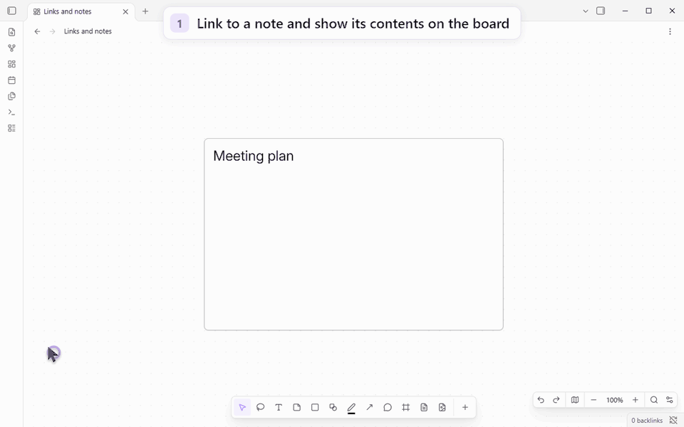

A Canvas preview shows card positions and connections, without the card text.
Click the embedded board's title to open it.

Preview and open another board

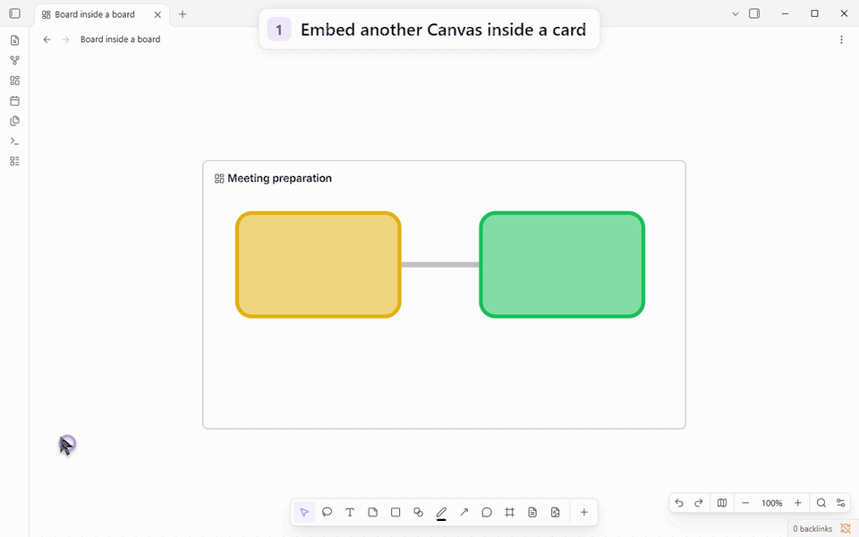

**Add file** offers **From Obsidian vault** or **From device**. The latter opens
the system file picker on your computer, tablet or phone. Selected images and
documents are copied into Obsidian's attachment folder and placed on the board.
Matching names get a new filename; existing files are preserved. On a computer,
you can also drag files from Obsidian's file list onto the board.

Obsidian renders Markdown
and formulas inside cards.

## Cards, shapes and frames

Square sticky notes hold quick thoughts and resize their text to fit.
Rectangles, circles, diamonds, arrows and other shapes help build diagrams,
including flowcharts. Palette tooltips explain each flowchart shape.
The text tool writes directly on the board.

Create a shape with text

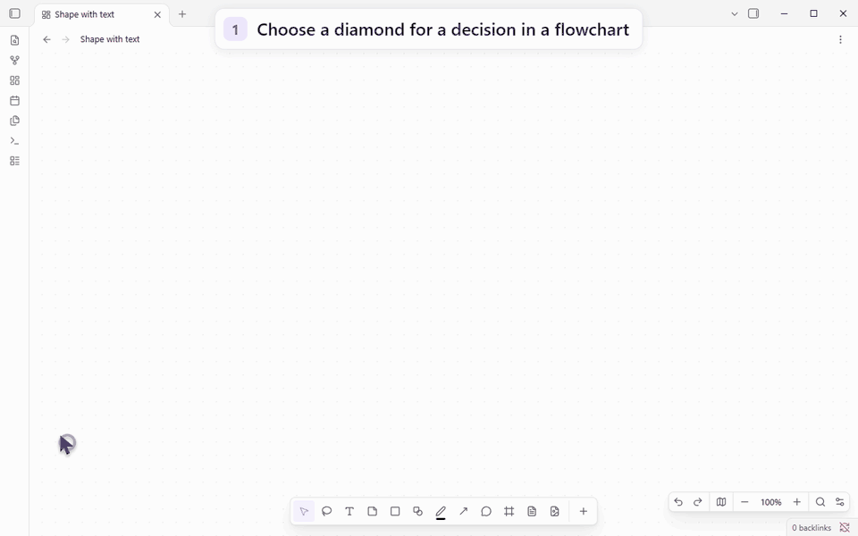

A **frame** is a named area, such as “Meeting” or “Next week”. Drag its title
to move the items inside with it.

Move a frame with its tasks

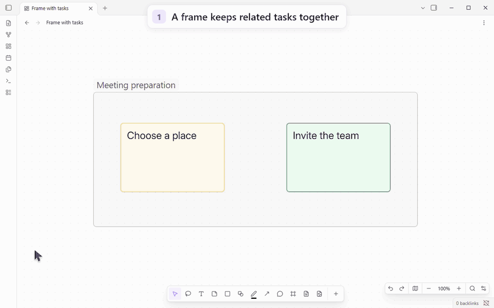

Select several items with a rectangle or lasso and move them together.
Copying between boards preserves styling and rotation. A pasted file card
still points to the original vault file; it does not duplicate the file.

Select and move several cards

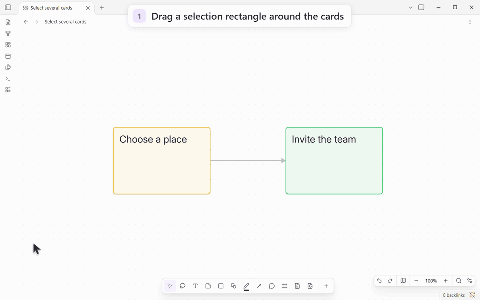

You can also add titled code blocks, Markdown tables and website links.

## Formatting

Native cards keep one rounded border. Their fill is painted once, including
translucent colours, and survives editing and undoing a shape change.

Selection menus stay inside the board when reopened or when the toolbar moves, including on phones.

Select a card to open its toolbar. Change the shape, font, text size,
formatting, alignment, line spacing, fill and border. Highlight words,
add a list or turn text into a link.

To format part of a card, enter text editing, select the words and choose a
font, size or style from the toolbar. The surrounding text stays unchanged.
On a phone, hold a word to select it. With the keyboard open, font and style
menus open above the toolbar.

Change font and colour

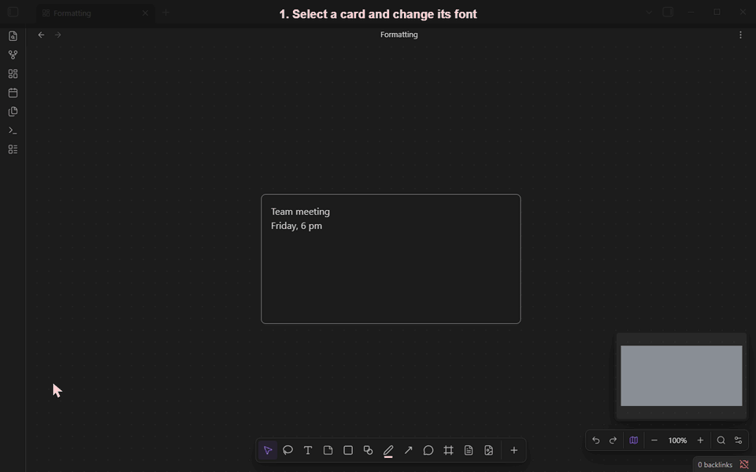

The round handle below a card rotates it; **Shift** uses 15° steps.
Side arrows create connected neighbouring cards. Drag a side arrow to draw
a line to another item.

Change overlapping order through **More** or the context menu: forward,
backward, front or back. Frames stay beneath cards. Selecting or dragging
an item keeps its layer order.

## Arrows and drawing

Choose **L** and draw between two cards. The line follows them as they move.
Change its colour, width, ends, label and route: straight, elbowed or curved.
Drag the middle to adjust a curve. A free end can stay on empty board.
Without a chosen colour, the line and arrowhead use Obsidian's theme colour
on computers, tablets and phones, including after reopening the board.

Move a connected card and undo

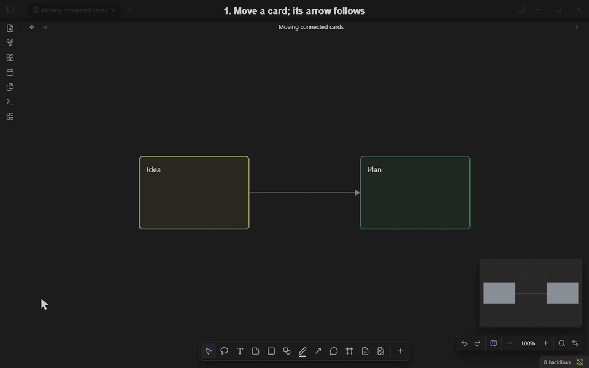

The **pen** creates individual strokes; the **highlighter** leaves a translucent
mark. Smart drawing straightens rough shapes and recognizes arrows. It recognizes
rectangles by their sides and corners, including tilted sketches. Rectangles,
ovals and triangles keep their tilt, rounded to the nearest 45° step.
Erasers remove a whole stroke or just part of it.

Draw and erase a stroke

Hold **Shift** to draw straight. Holding the pen at the end of a stroke for
about half a second also straightens it, including with pressure enabled.
Enable **Hold to draw a straight line** in drawing settings to use this.
Thickness stays steady while holding and lifting the pen; movement continues
to change thickness with pressure. Pressing the active pen or line button again hides its settings
while keeping the tool selected.

Line labels use the same fonts and formatting as card text. Snapping helps
attach ends to card outlines and anchor points. Connections to other lines
are experimental and disabled by default.

## Comments and locking

Press **C** and choose a place for a comment: a card, picture, line or empty
area. Click the pin to read the thread. Reply, mark it resolved or reopen it
later. A separate panel lists comments for the board or selected item.

Reply and resolve a comment

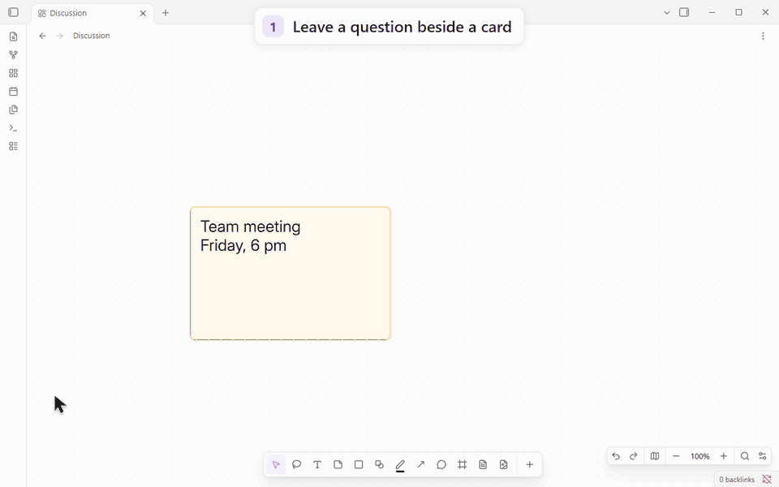

Set your name and author colours in settings. Imported Miro comments can
be read and hidden. Comments are stored in the board file. The plugin itself
does not send them to other people or provide a shared editing server.

The **lock** protects an item from moves, resizing, edits and deletion.
**Review mode** in the board menu protects the whole board, while allowing
navigation, links, copying and comments.

## Search and navigation

Click or drag on the minimap to visit another part of the board. The zoom
percentage opens preset scales, fit-to-board and snapping options.
Nearby buttons undo and redo actions.

**Ctrl + F**, or **Cmd + F** on Mac, searches cards, frame and file names,
line labels and comments. **Enter** visits the next match; **Shift + Enter**
visits the previous one. **Escape** closes search. The magnifying-glass button
opens it too.

Find a card outside the current view

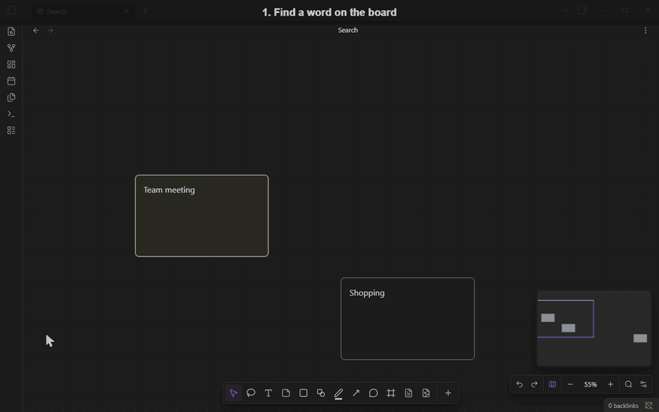

While editing text, Ctrl + F searches inside the card as usual in Obsidian.
Board search does not change content and works in review mode.

## Make it yours

In **Settings → Miro Canvas**, use **Go to section** to reach drawing,
tools, fonts or another group without searching the whole page. Getting started
is at the top; all parameters remain visible below the selector.

The gear opens the board menu. **Arrange panels** lets you move the toolbar,
navigation buttons and minimap, switch between rows and columns, reorder tools
and put less-used tools under **+**. The spare-tools list follows the toolbar.
The drag grip and turn button have separate touch targets. An insertion line
shows where a tool will land when you reorder it. **Done** or Escape ends
arranging; **Reset** restores the default layout.

Tools and navigation each have a fold button inside their menu. The toolbar
groups its fold button and “+” together, with one separator before the tools. A folded panel becomes a small square button.
Tap to fold or open a panel. Hold until the button gains an outline, then
drag to move it; this works with an open panel too. Positions and folded
states are remembered separately for computers, tablets and phones.
On narrow screens, an open bar wraps towards the available space while its fold button stays in place.

In plugin settings, you can hide each panel’s fold button; it remains
available while arranging panels. In that mode, open “+” and drag a spare
tool onto the main row: the insertion line shows where it will land.

The button stays at the edge of its panel, clear of the tools. On a computer,
an open panel shows it only in **Arrange panels** mode.

Fold repeatedly and move an open or folded panel

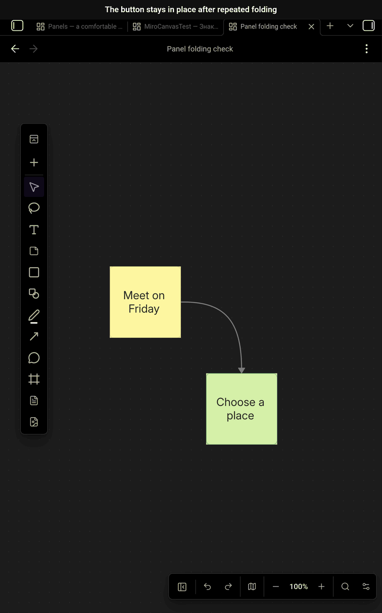

Move a toolbar to the side

Panel positions and tool choices are saved separately for computers, tablets
and phones. A side toolbar on your tablet can stay at the bottom on your
computer. Default panels make room for each other in narrow windows;
you can choose your own placement.

Settings also cover board theme, zoom limits and steps, wheel behaviour,
snapping, the minimap and attachment names. The interface follows Obsidian's
language, with English and Russian available.

In **Arrange panels**, drag the minimap’s corner to resize it. The size is
saved separately for each device.

Resize the minimap

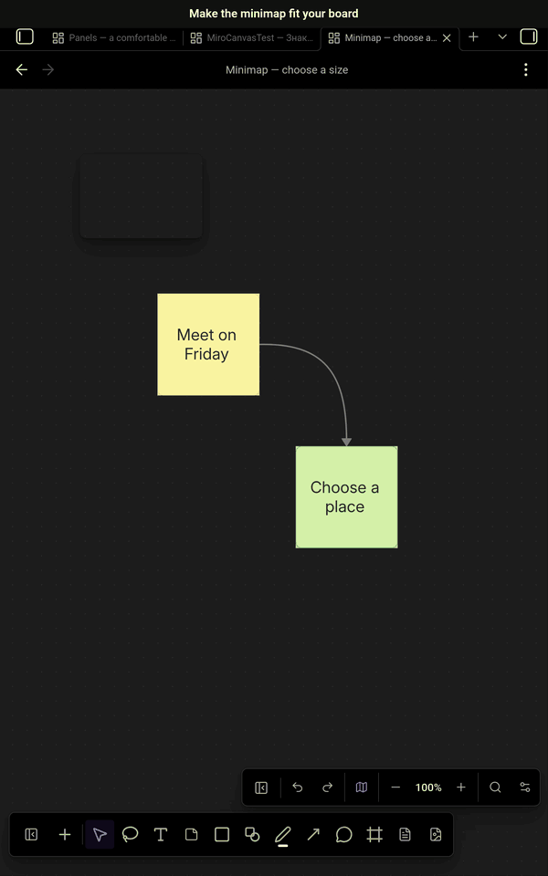

**Fonts.** Add a `.ttf`, `.otf`, `.woff` or `.woff2` file, choose the fonts
offered by the toolbar and reorder them. Optional packs include Miro and
Excalidraw fonts and open alternatives to common Word fonts. A pack downloads
only when you press **Download**. Hiding a font from the list keeps its file.

## Phone and tablet

Android uses the same boards. Panel positions and toolbar buttons are saved
separately for a phone, tablet and computer. On a small screen, keep frequent
tools below and place navigation at the side. Other tools remain available
under “+”. You can hide the minimap. Bottom panels step aside for the on-screen keyboard; the formatting
toolbar remains beside the card being edited.

One finger on empty board pans; two fingers change zoom. A selected card
can be dragged immediately. Hold an unselected card briefly before dragging.
A long press opens a card's menu or starts rectangle selection on empty board.

Phone: move a card with touch

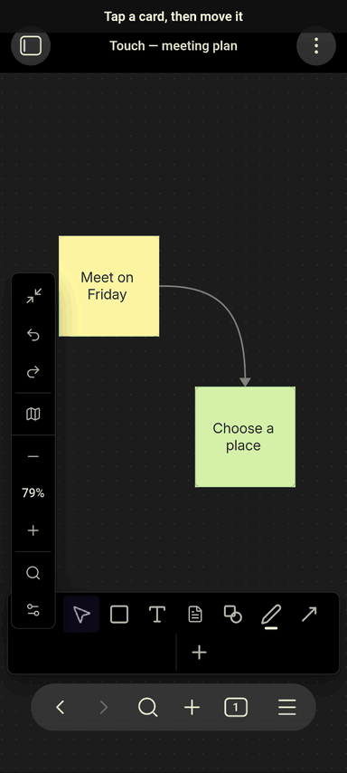

Phone: pan and zoom the board

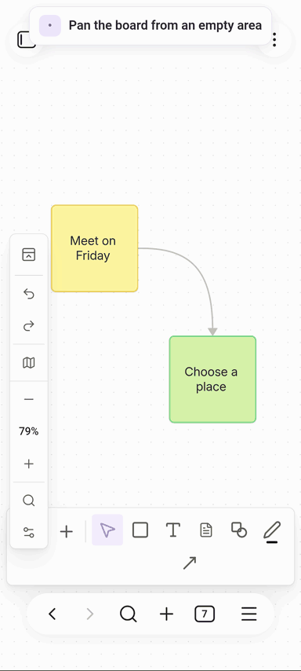

Phone: place navigation at the side

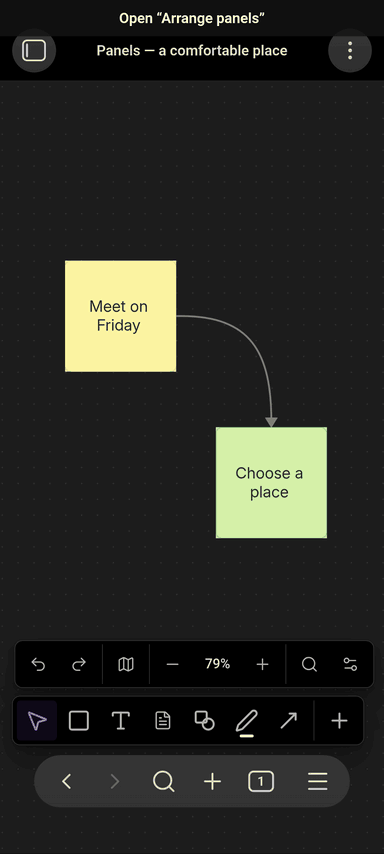

On a tablet, place the tools in a column at the left edge and keep navigation
below. Pen and line settings open beside the vertical toolbar. This is one
possible layout: move and turn panels to suit your own workspace.

Tablet: move a card with touch

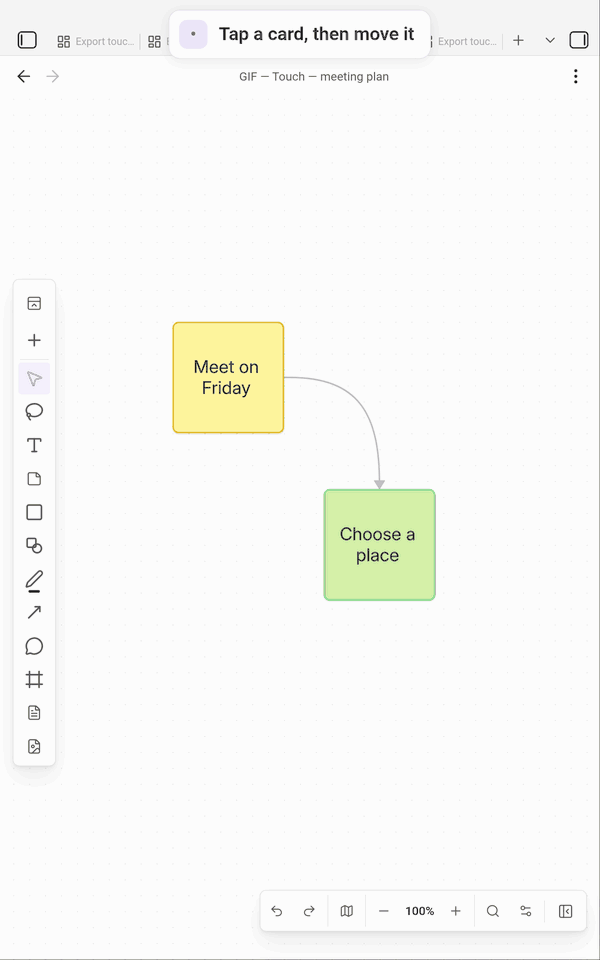

Tablet: pan and zoom the board

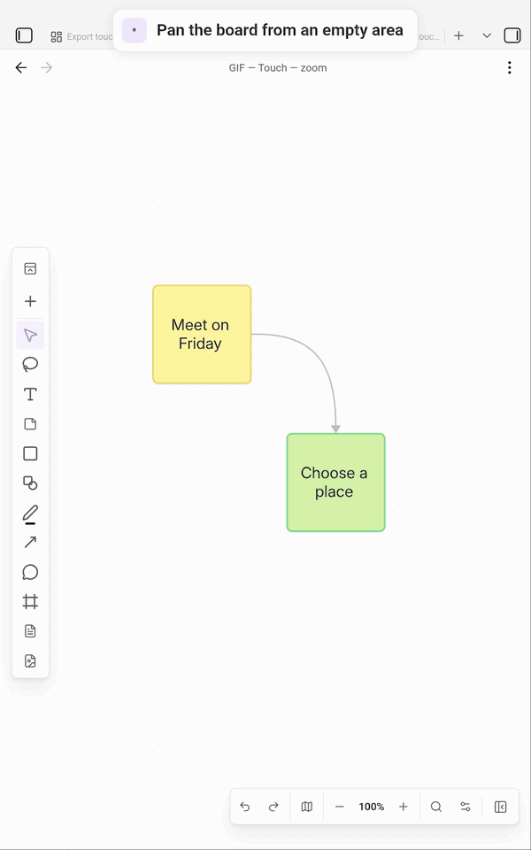

Tablet: turn and move the toolbar

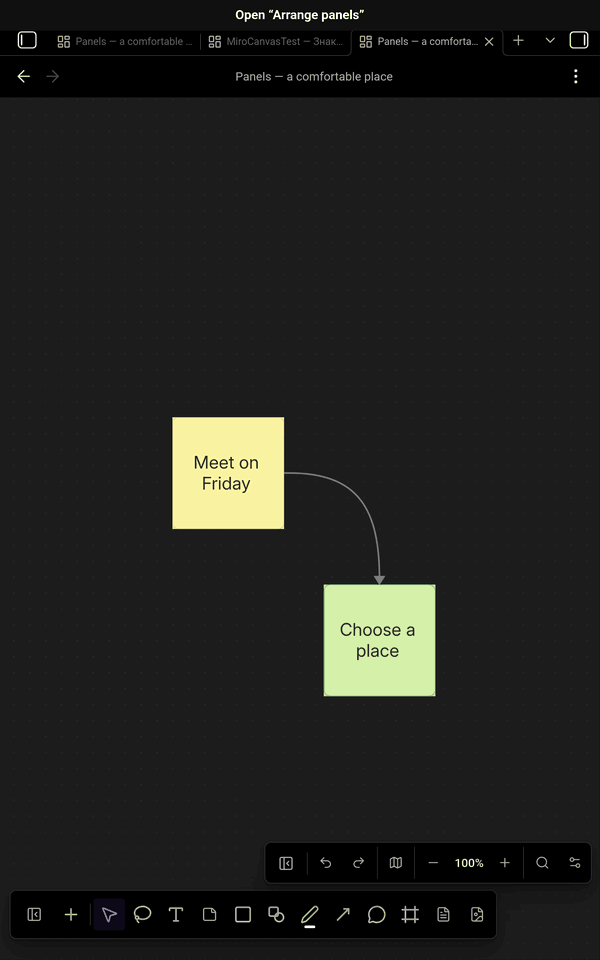

**Settings → Miro Canvas → Drawing** has two independent switches:
**Pen pressure** changes width along the line while you draw with a stylus;
turn it off for constant width. The highlighter keeps constant width.
**Draw with a finger** allows drawing on tablets without a stylus. It starts
off; one finger pans until enabled. Two fingers still pan and zoom, and
palm protection tracks the pen's presence.

Drawing settings, live pressure and finger drawing

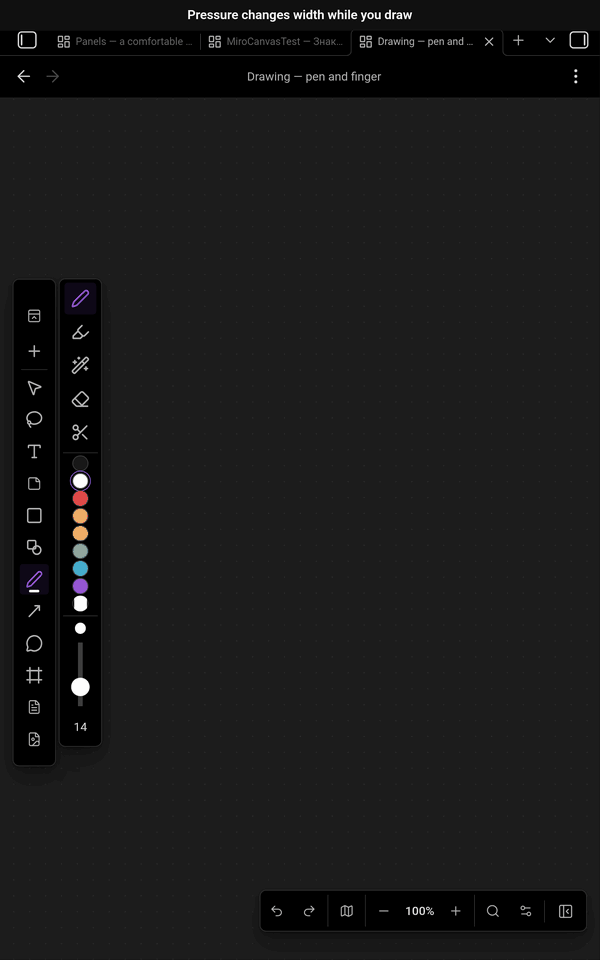

Double-tapping empty board puts the tool away without leaving dots.
 Behaviour depends
on the events the device supplies. The S Pen side button does not reach the
plugin in the checked Obsidian version.

Mobile recordings use a Samsung SM-X736B and Galaxy A33 (SM-A336E).
Touches were sent through Android and the two-finger gesture through WebView.
The pressure example supplies changing pen samples through CDP. These
recordings do not verify physical pen pressure or palm contact.
iPhone, iPad, macOS and Linux were not checked in this recording series.

## Export

On your computer, tablet or phone, choose gear → **Export to PDF or PowerPoint**. Mark pages on
the board, move them or resize them. **A page for each frame** adds pages
automatically. Formats include A4, A3, Letter, 16:9, 4:3 and a custom size,
with portrait or landscape orientation. Page layout is saved with the board.

Drag a page’s label above its top-left corner to move it. Drag the dot at its
bottom-right corner to resize it. Fixed paper formats keep their proportions;
choose **Free size** for independent width and height. Click a page name in
the export panel to bring its frame into view.

Move and resize export pages

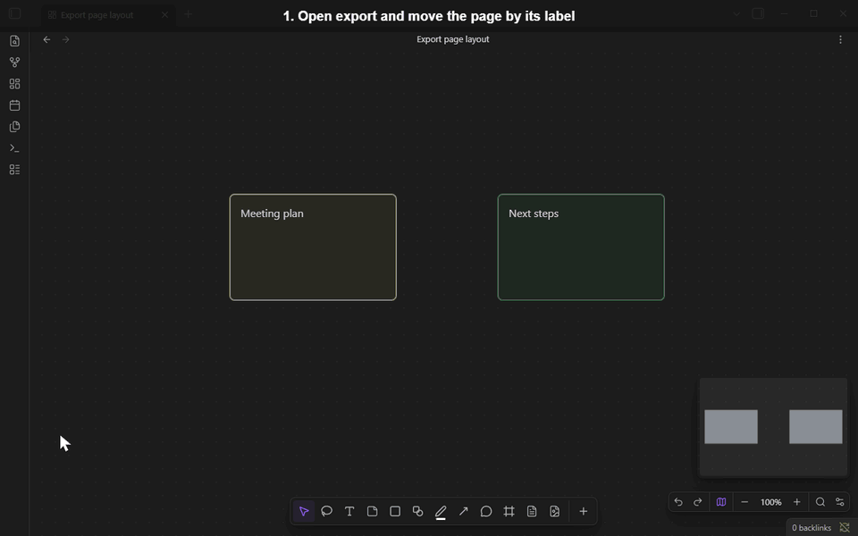

Arrange pages and save PDF and PowerPoint

[PDF](docs/media/en/export-example.pdf) · [PowerPoint](docs/media/en/export-example.pptx)

Each PDF page and PowerPoint slide contains an **image of the board**.
Card text and shapes are not separate editable slide objects. Files are saved
in the vault using Obsidian’s attachment location with unique filenames.
Live web embeds and video are omitted. Standard quality uses 2000 pixels on
the long side, high quality 3000. Stop cancels export and restores the view.

## Bring boards from Miro and other plugins

The separate [miro2obsidian](https://github.com/NixWrk/Miro_2_Obsidian) program
exports Miro data and creates vault files. Miro Canvas displays those boards.

Open **Settings → Miro Canvas → Open the import guide** for the program setup,
creating a Miro app and exporting in **miro-canvas** format. The guide also
includes a prompt for an AI agent. The plugin does not install or launch
the conversion program.

Excalidraw, list-based Enhancing Mindmap and Markmind maps, and Advanced
Canvas can be imported with **Import into a board** from a file's menu or
the command palette. Preview what will transfer and where the new board
will be created. The source file is preserved.

Some styling differs: Excalidraw hatching is omitted, mind maps receive a new
layout and Advanced Canvas groups appear expanded. An import report lists
approximations. See the [full import guide and limitations](docs/import.md).

## Files, network use and limitations

Boards remain `.canvas` files in your vault. With the plugin disabled,
native Canvas still opens the cards, files and ordinary connections.
Miro Canvas styling, comments and free-standing lines are stored as additional
data and need the plugin to display. Imported Miro data is kept as source
evidence and is not changed by board edits.

Editing a board works offline. The plugin contacts GitHub to check for a new
release, at most once a day at startup, and to download a font pack when you
request one. You can disable update checks. They announce new releases
without installing them.

No account, subscription or payment is required. The plugin contains no telemetry
or advertising and never installs or updates itself.

**Files outside the vault.** Adding device files, custom fonts or a local import
reads only the files you select in a system picker and copies the chosen data
into the vault. Export creates a new attachment and preserves existing files.
The plugin does not scan folders outside the vault.

Website links and embeds can contact their sites through Obsidian.
BRAT, Obsidian Sync and other plugins have their own network behaviour.

These limitations remain:

- Imported Miro tables have no cell text because the export does not supply it.
- Line-to-line connections are experimental and disabled by default.
- Moving a large selection on a board with thousands of cards can be slow.
- Testing across all devices and link types is still incomplete.

## Installing

Miro Canvas is preparing for submission to the [Obsidian Community directory](https://community.obsidian.md/).
It is not yet available in the in-app catalog. Until it is accepted, use BRAT
or the manual installation below. Requires Obsidian **1.13.7 or newer**; this
is the oldest version verified in the current real-app test suite. Desktop
editing and PDF/PPTX export on Windows and Android tablets are tested;
export-page touch gestures are also checked on a physical Android phone.
iOS, macOS and Linux remain unverified.

**With BRAT.** This plugin installs GitHub releases and can update them.

1. In **Settings → Community plugins**, install and enable **BRAT** by **TfTHacker**.
   Turn off restricted mode first if community plugins are blocked.
2. Run **BRAT: Plugins: Add a beta plugin for testing (with or without version)**
   from the command palette.
3. Paste `NixWrk/Obsidian-Plugin---Miro-Canvas` into **Repository**, then press Tab.
4. Choose **Latest version**, keep **Enable after installing the plugin**
   selected and press **Add plugin**. Releases named `fonts-…` are font packs.

BRAT's settings control automatic updates. If GitHub reports a request limit,
wait for the stated period and try again.

**Manually.** Download `main.js`, `manifest.json` and `styles.css` from the
[latest release](../../releases/latest), place them in
`<vault>/.obsidian/plugins/miro-canvas/` and enable **Miro Canvas** in community
plugins. Replace those three files to update.

## Reference, plans and development

The [command and settings reference](docs/reference.md) lists the tools and
commands. [Plans and design notes](docs/miro-canvas.md) describe current work.
The [recording review](docs/visual-guide.md) distinguishes completed examples
from checks and demonstrations still to do.

Open work includes platform and device checks (`FUT-010`), the complete
visual reference (`FUT-012`), all links and formulas (`FUT-017`), and a new
user's journey from installation to importing a board (`FUT-004`). Large
selections and line-to-line connections also need improvement. A GIF for one
feature does not complete the entire task.

Build with `npm ci`, `npm run check`, `npm test` and `npm run build`.
See the [contributor guide](docs/contributing.md) for validation and releases.
The [community submission package](docs/community-submission.md) contains the
listing text, release checks, policy disclosures and remaining review question.

### Working on this repository with an AI agent

Read [AGENTS.md](AGENTS.md) and the [workflow, release and GIF recording
instructions](docs/contributing.md) before changing the repository.
For interface work, follow the existing host-based [design rules](DESIGN.md).
Before a lint fix, trace its affected user actions and add their mandatory
checks to [the regression register](docs/lint-remediation-checks.md). Keep
unit, synthetic, real-app and physical-device evidence separate.
Board reading and editing use the optional [MCP server](mcp/README.md) and
[miro-canvas-format skill](.agents/skills/miro-canvas-format/SKILL.md).
The server is started separately by its owner's configuration; the plugin
does not start it.

## License

[MIT](LICENSE). Adapted LZ-string code and its MIT notice are documented in
[Third-party notices](THIRD_PARTY_NOTICES.md). Optional font packs carry their
own font licenses; these are included with each pack.

Miro Canvas is an independent community project by NixWrk, unaffiliated with
Miro or Obsidian.
