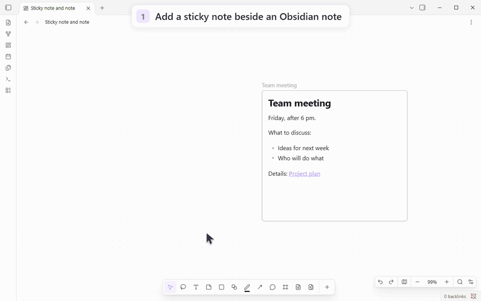
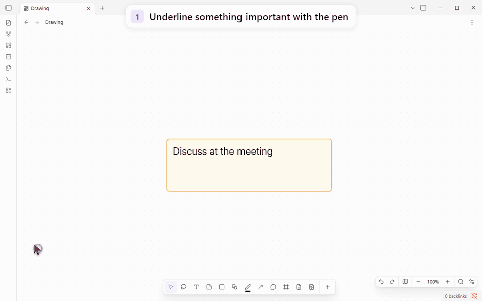
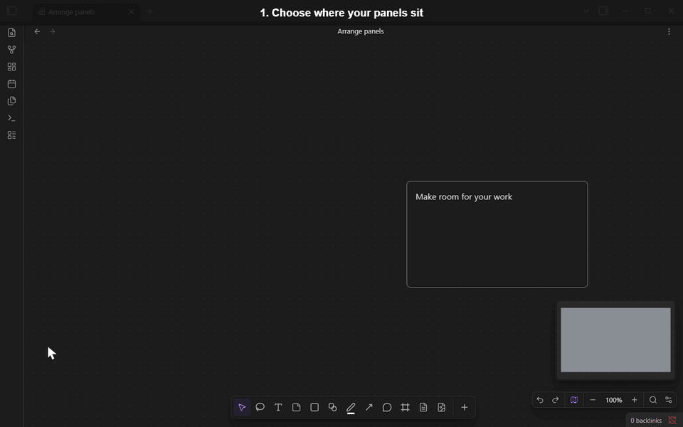
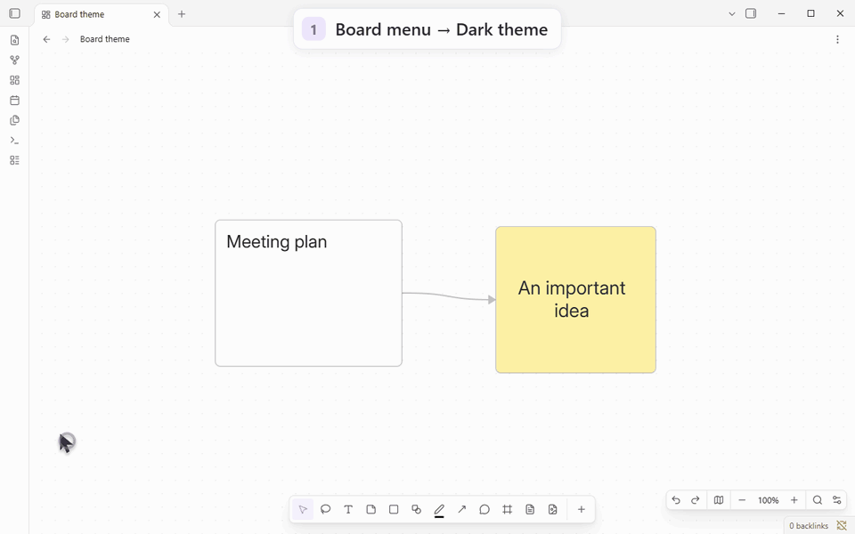
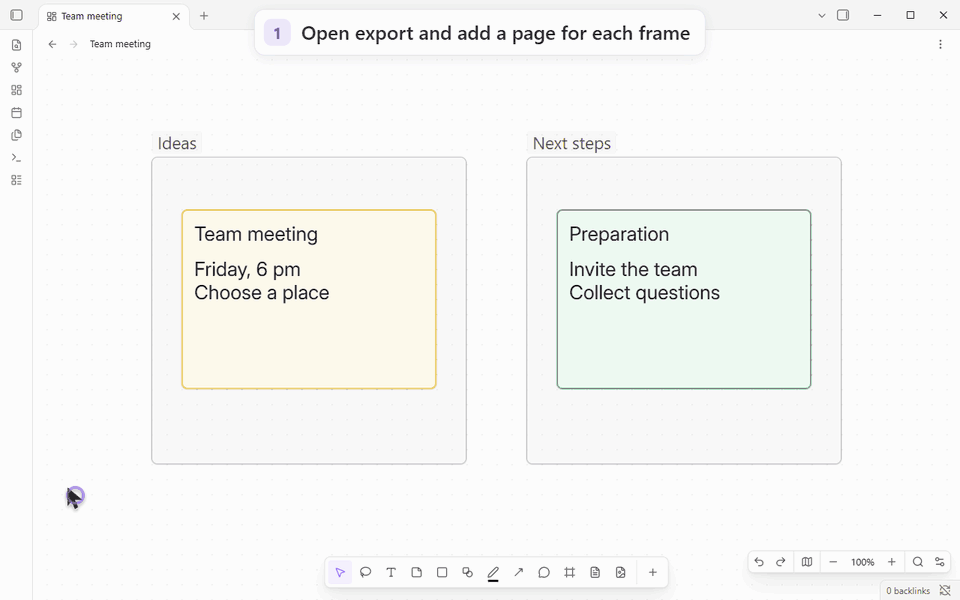

# Miro Canvas

**A visual workspace for your Obsidian notes, with Miro-style tools.**

Plan with sticky notes, sketch diagrams, draw and leave comments — all on
Obsidian's own Canvas. Bring in notes and attachments from your vault and
connect them with arrows. Your board stays a local `.canvas` file.

[Русский](README.ru.md) · [Install](#installing) · [Get started](#getting-started) · [User guide](docs/guide.md) · [Releases](https://github.com/NixWrk/Obsidian-Plugin---Miro-Canvas/releases)



## What you can do

| Task | Tools |
| --- | --- |
| **Plan and organize** | Sticky notes, text, shapes, flowcharts and frames that move with their contents. |
| **Use your notes** | Vault notes, `[[links]]`, embeds, images, PDFs, code blocks and Markdown tables. |
| **Connect ideas** | Straight, elbowed and curved arrows with labels; attached lines follow the cards. |
| **Draw** | Pen, highlighter, smart shape recognition and whole-stroke or partial erasers. |
| **Discuss and review** | Comment threads, replies, resolved comments, item locks and board review mode. |
| **Make it yours** | Fonts, colors, light/dark board themes, movable panels, tool order, search and a minimap. |
| **Share the result** | PDF and PowerPoint export with pages you arrange yourself or create from frames. |

Panels and tool choices are remembered separately for computers, tablets and
phones. Android supports touch navigation, stylus drawing and optional finger
drawing. The interface is available in English and Russian.

<details>
<summary>See drawing and erasing</summary>



[Drawing tools and shortcuts](docs/guide.md#arrows-and-drawing)

</details>

<details>
<summary>See how to arrange the panels</summary>



[Panel layout, themes and fonts](docs/guide.md#make-it-yours)

</details>

<details>
<summary>See light and dark board themes</summary>



</details>

<details>
<summary>See PDF and PowerPoint export</summary>



[Example PDF](docs/media/en/export-example.pdf) · [Example PowerPoint](docs/media/en/export-example.pptx) · [Export guide](docs/guide.md#export)

</details>

Open the GIF at full size for small controls.

Export renders an independent board snapshot without screen capture, so you can
keep editing or open another board.
Files are saved as new vault attachments. Raster PDF/PPTX store a picture per
page. The development build adds a **Raster / Vector** choice for PDF and
PowerPoint, while SVG remains a separate, always-vector format. Vector PDF
embeds Noto Sans in four styles; source fonts are substituted. Vector PowerPoint
stores one SVG per slide with a JPEG fallback for older readers; its text and
shapes are not separate native PowerPoint objects. Live web embeds and video
are omitted. [Modes and checks](docs/vector-viewing-acceptance.md).

## Canvas expansion in 0.3.0

**Board appearance:** “Obsidian” follows the current Obsidian light/dark theme, even when the device uses another theme. Explicit board Light/Dark choices stay independent. Long board-menu labels wrap inside the menu.


The selection toolbar’s **More** menu lists labelled actions: layer order, board actions and native Canvas commands, with Delete last.

The **Export** panel groups page ordering and paper/quality controls, with a scrolling body and persistent Close/output actions. Touch controls and safe-area/keyboard bounds are checked in native Obsidian. [Panel checks](docs/export-panel-design-checks.md).

Version 0.3.0 adds the following board workflows. Verification and remaining
coverage follow-ups are tracked in the
[feature plan](docs/canvas-enhancement-plan.md) and
[integration checks](docs/obsidian-integration-checks.md).

| Feature | Behavior and limits |
| --- | --- |
| **Search linked notes** | Board search includes Markdown file-card contents and heading/block slices, with match-case and a bounded regular-expression mode. |
| **Connections** | Reverse direction with **Reverse connection direction** (Flip), select incoming/outgoing/connected lines, or highlight them without changing selection. |
| **Compact groups** | Collapse a group for viewing; its real cards, connections and stored positions remain in the file. |
| **Move a selection** | Move cards and internal lines to a new board; crossing lines attach to its file card. Undo restores the source selection and retains the new board file. |
| **Board properties and card links** | Edit properties, tags and aliases; copy a link or embed for an individual card. Supported metadata integration adds graph, outgoing and backlink data through temporary caches and reversible pane hooks. |
| **Note-property connections** | Optionally generate connections between file cards from note-property links, preserving manual connections. |
| **Shared colors and styles** | Prefer a permanent palette across boards while retaining customized local palettes. Apply named, scoped CSS declarations from a restricted subset. |
| **Zoom content** | Set content thresholds for text, file, web and Miro cards; selected or edited cards stay readable. |
| **Card corners** | Set a radius from 0 to 48 board pixels using a slider or a precise value; zero gives square cards. Diagram geometry stays unchanged. |
| **Shape corners** | Rectangular figures have equal horizontal/vertical radii in board units. At the minimum zoom configured in plugin settings (200% by default; 0 means any zoom), drag the corner marker with its bidirectional arrow using a finger, pen or mouse; the marker moves with the radius and the live value appears above the held control. Click it for an exact value; disable the controls in plugin settings. New click/drop shapes use the catalogue proportions, while free drawing keeps your dimensions. |
| **CSS snippets** | Supported Obsidian snippets are excluded from boards by default. Allow individual installed snippets in searchable settings; normal notes and the selected theme retain their styling. |
| **Viewing and slides** | Review hides editing/creation menus; selected web links retain a direct Open link action. Toggle a temporary laser from the viewing dock or slideshow bar. **Present slides** uses native frames in file order, or export pages when there are no frames. In viewing mode, a finger drag can start on a card or selection to pan the board without changing card positions or history. |
| **Vector PDF/PowerPoint** | Choose Raster or Vector in Export. PDF uses embedded Noto Sans; PowerPoint embeds SVG per slide with an older-reader picture fallback. |
| **Vector export** | Export actual shapes, lines and text to SVG, with clipped pages stacked vertically. Intrinsic raster attachments remain images. |

SVG references installed fonts and omits cosmetic shadows. Unsupported rich
content is refused explicitly, including live/PDF embeds, list markers and
complex or rotated HTML text. [SVG scope and checks](docs/vector-export-checks.md).
Snippet isolation supports ordinary selectors and conditional rules, including
inheritance and `!important`. Imports, font-face/keyframe/property definitions,
unverified popout styles and layout effects on ancestors outside the board are
not fully isolated; unsupported sheets produce a notice and may still apply.
[Snippet scope and checks](docs/canvas-snippet-checks.md).

Board-property/tag search supplements native results for positive
conjunctions, such as `tag:project [status:"active"]`. OR, negation, regex and
mixed content/path queries are not supplemented; native search still runs.
Property-only backlink rows require an empty backlink filter and open the real
board without invented text offsets. Private API shapes, scan limits and
unsupported syntax can prevent supplementation. These additions do not make
Canvas root properties native Markdown frontmatter.

Windows, tablet and legacy-phone checks cover typed property search and genuine
board/note navigation. The SM-A336E/Obsidian 1.12.7 checks also cover gestures,
themes and independent exports; that app is below the supported minimum.
[Phone input distinctions and results](docs/smartphone-enhancement-checks.md).

[Behavior, persistence and remaining checks](docs/miro-canvas.md#canvas-expansion--030)

## Installing

Requires **Obsidian 1.13.7 or newer**. Directory publication is pending; use
BRAT or install manually. Windows and Android have real-app checks; iOS,
macOS and Linux remain unverified. [Test coverage](docs/lint-remediation-checks.md).

### With BRAT

1. In **Settings → Community plugins**, install and enable **BRAT** by
   **TfTHacker**. Leave restricted mode if community plugins are blocked.
2. Open the command palette and run **BRAT: Plugins: Add a beta plugin for
   testing (with or without version)**.
3. Paste this into **Repository**, then press Tab:

   ```text
   NixWrk/Obsidian-Plugin---Miro-Canvas
   ```

4. Choose **Latest version**, keep **Enable after installing the plugin**
   selected and press **Add plugin**.

BRAT manages its own automatic updates. Releases named `fonts-…` are font
packs, not plugin releases.

### Manually

Download **`main.js`**, **`manifest.json`** and **`styles.css`** from the
[latest release](https://github.com/NixWrk/Obsidian-Plugin---Miro-Canvas/releases/latest).
Put them in `<vault>/.obsidian/plugins/miro-canvas/`, then enable **Miro Canvas**
in community plugins. Replace these three files to update.

## Getting started

1. Open or create a Canvas board.
2. Choose **Sticky note** (`N`) and click an empty place to write an idea.
3. Drag a note from your vault onto the board.
4. Choose **Lines and arrows** (`L`) to connect the two cards.
5. Select a card to change its color, font or shape.

For a guided tour, accept the first-run **welcome board**, or create it from
**Settings → Miro Canvas → Getting started → Create the welcome board**.
It includes editable examples, real notes and sample PDF/PowerPoint files.
Creating another copy preserves your existing boards.

Shortcuts work while you are not editing text:

| Key | Tool |
| --- | --- |
| V | Select |
| T | Text |
| N | Sticky note |
| S | Shape |
| P | Pen |
| L | Line |
| C | Comment |
| F | Frame |

**Escape** puts the tool away. **Ctrl + Z** / **Cmd + Z** undoes an action.
[Continue with the illustrated guide →](docs/guide.md)

## Bring in an existing board

- **From Miro:** use the separate [miro2obsidian](https://github.com/NixWrk/Miro_2_Obsidian)
  converter to create vault files, then open the board with Miro Canvas.
- **From Excalidraw, Enhancing Mindmap, Markmind or Advanced Canvas:** choose
  **Import into a board** from the file menu or command palette. Review the
  preview before creating the board; the original file is preserved.

Some styles and layouts are approximated; imported Miro tables lack cell
text because the source export does not supply it.
[Import instructions and limitations](docs/import.md).

## Your files and privacy

Boards stay in your vault. With the plugin disabled, ordinary Canvas still
opens native cards, notes and connections. Plugin styling, drawings, comments
and free-standing lines require Miro Canvas to display. Imported Miro source
data is preserved when you edit.

Editing works offline. The plugin's only network requests are a GitHub release
check at most once a day at startup (**you can turn it off**) and a font pack
download when you press **Download**. Release checks announce updates without
installing them. No account, payment, advertising or telemetry.

Device files, custom fonts and local imports read only the files you select
and copy the chosen data into the vault; the plugin does not scan external
folders. Website links and embeds can contact their sites through Obsidian.
BRAT, Sync and other plugins have their own network behavior.

Line-to-line connections are experimental and off by default. Moving a large
selection on boards with thousands of cards can be slow.

## Documentation and development

- [Illustrated user guide](docs/guide.md) — detailed steps and all demonstrations.
- [Commands and settings](docs/reference.md) · [Import guide](docs/import.md).
- [Changelog](CHANGELOG.md) · [Plans and design notes](docs/miro-canvas.md).
- [Contributing, checks and releases](docs/contributing.md).

### Working on this repository with an AI agent

Start with [AGENTS.md](AGENTS.md) and the [contributor guide](docs/contributing.md),
including the release, font-pack and GIF workflows. Interface work follows
[DESIGN.md](DESIGN.md); lint fixes first record affected actions in
[the regression register](docs/lint-remediation-checks.md).

Development uses Node **22.13+** on supported 22/24/26 lines:

```bash
npm ci
npm run check
npm test
npm run build
```

Agents can use the optional [CLI or MCP server](mcp/README.md) and
[miro-canvas-format skill](.agents/skills/miro-canvas-format/SKILL.md) to read and
edit boards. Ready-to-run tools are in the latest release and need **Node 20+**;
run them separately, outside the plugin folder. The plugin starts neither.

[Source compatibility notes](docs/contributing.md#remaining-source-warnings)
explain retained Node imports for these tools, the `.obsidian` default for
configuration and the command ID that preserves saved hotkeys.

## License

[MIT](LICENSE) · [Third-party notices](THIRD_PARTY_NOTICES.md).
Optional font packs include their own font licenses.

An independent community project by NixWrk, unaffiliated with Miro or Obsidian.
