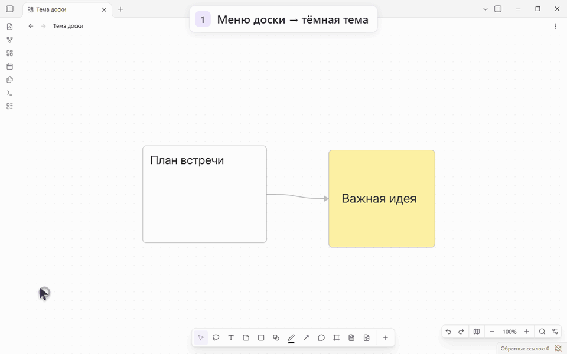

# Miro Canvas

**Доска для ваших заметок Obsidian с инструментами в духе Miro.**

Планируйте на стикерах, стройте схемы, рисуйте и оставляйте комментарии прямо
в обычном Canvas. Добавляйте заметки и вложения из хранилища, соединяйте их
стрелками. Доска остаётся локальным файлом `.canvas`.

[English](README.md) · [Установка](#установка) · [Быстрый старт](#быстрый-старт) · [Руководство](docs/guide.ru.md) · [Выпуски](https://github.com/NixWrk/Obsidian-Plugin---Miro-Canvas/releases)


## Что можно делать

| Задача | Возможности |
| --- | --- |
| **Планировать** | Стикеры, текст, фигуры, блок-схемы и фреймы, которые перемещаются вместе с содержимым. |
| **Работать с заметками** | Заметки хранилища, `[[ссылки]]`, встраивания, изображения, PDF, блоки кода и таблицы Markdown. |
| **Связывать идеи** | Прямые, ломаные и изогнутые стрелки с подписями. Прикреплённые линии следуют за карточками. |
| **Рисовать** | Перо, маркер, распознавание фигур и ластики для удаления целого штриха или его части. |
| **Обсуждать** | Комментарии, ответы, отметки «решено», блокировка элементов и режим просмотра доски. |
| **Настраивать под себя** | Шрифты, цвета, светлая и тёмная темы доски, подвижные панели, порядок инструментов, поиск и миникарта. |
| **Делиться результатом** | Экспорт в PDF и PowerPoint: страницы вручную или по фреймам. |

Расположение панелей и набор инструментов запоминаются отдельно для
компьютера, планшета и телефона. На Android доступны жесты, рисование
стилусом и, по желанию, пальцем. Интерфейс — на русском и английском.

<details>
<summary>Как рисовать и стирать</summary>


[Инструменты рисования и горячие клавиши](docs/guide.ru.md#стрелки-и-рисование)

</details>

<details>
<summary>Как расположить панели</summary>


[Панели, темы и шрифты](docs/guide.ru.md#настройка-под-себя)

</details>

<details>
<summary>Как переключать светлую и тёмную темы</summary>



</details>

<details>
<summary>Как экспортировать в PDF и PowerPoint</summary>


[Пример PDF](docs/media/ru/export-example.pdf) · [Пример PowerPoint](docs/media/ru/export-example.pptx) · [Руководство по экспорту](docs/guide.ru.md#экспорт)

</details>

Мелкие кнопки удобнее рассматривать в GIF полного размера.

Экспорт работает в фоне: можно продолжать редактирование или открыть другую
доску. Файлы сохраняются как новые вложения в хранилище. **Каждая страница
или слайд — изображение доски**: текст и фигуры в PowerPoint не становятся
отдельно редактируемыми объектами. Веб-встраивания и видео не экспортируются.

## Установка

Нужен **Obsidian 1.13.7 или новее**. Публикация в каталоге ещё ожидается;
используйте BRAT или ручную установку. Проверки в настоящем приложении есть
для Windows и Android; iOS, macOS и Linux пока не проверены.
[Результаты проверок](docs/lint-remediation-checks.md).

### Через BRAT

1. В **Настройки → Сторонние плагины** установите и включите **BRAT** от
   **TfTHacker**. Если плагины заблокированы, выйдите из ограниченного режима.
2. Откройте палитру команд и выполните **BRAT: Plugins: Add a beta plugin for
   testing (with or without version)**.
3. Вставьте в поле **Repository** и нажмите Tab:

   ```text
   NixWrk/Obsidian-Plugin---Miro-Canvas
   ```

4. Выберите **Latest version**, оставьте **Enable after installing the plugin**
   и нажмите **Add plugin**.

Автоматические обновления управляются настройками BRAT. Выпуски `fonts-…`
содержат наборы шрифтов, а не сам плагин.

### Вручную

Скачайте **`main.js`**, **`manifest.json`** и **`styles.css`** из
[последнего выпуска](https://github.com/NixWrk/Obsidian-Plugin---Miro-Canvas/releases/latest).
Поместите их в `<хранилище>/.obsidian/plugins/miro-canvas/` и включите
**Miro Canvas** в сторонних плагинах. Для обновления замените эти три файла.

## Быстрый старт

1. Откройте или создайте доску Canvas.
2. Выберите **Стикер** (`N`) и нажмите на пустое место, чтобы записать идею.
3. Перетащите заметку из хранилища на доску.
4. Выберите **Линии и стрелки** (`L`) и соедините две карточки.
5. Выделите карточку, чтобы изменить цвет, шрифт или фигуру.

Для знакомства откройте **доску знакомства** при первом запуске или
создайте её через **Настройки → Miro Canvas → Начало работы → Создать
доску знакомства**. Внутри — примеры, которые можно редактировать,
настоящие заметки и образцы PDF/PowerPoint. Новая копия сохраняет прежние
доски и ваши изменения.

Горячие клавиши работают, когда вы не редактируете текст:

| Клавиша | Инструмент |
| --- | --- |
| V | Выделение |
| T | Текст |
| N | Стикер |
| S | Фигура |
| P | Перо |
| L | Линия |
| C | Комментарий |
| F | Фрейм |

**Escape** убирает инструмент. **Ctrl + Z** / **Cmd + Z** отменяет действие.
[Продолжить знакомство в наглядном руководстве →](docs/guide.ru.md)

## Перенос готовой доски

- **Из Miro:** создайте файлы хранилища отдельной программой
  [miro2obsidian](https://github.com/NixWrk/Miro_2_Obsidian), затем откройте
  доску с Miro Canvas.
- **Из Excalidraw, Enhancing Mindmap, Markmind или Advanced Canvas:** выберите
  **Импортировать в доску** в меню файла или палитре команд. Посмотрите
  предварительный просмотр; исходный файл сохраняется.

Часть оформления и расположения передаётся приблизительно. Таблицы из Miro
приходят без текста ячеек: его нет в используемой выгрузке.
[Инструкции и ограничения импорта](docs/import.ru.md).

## Файлы и приватность

Доски хранятся в вашем хранилище. С выключенным плагином обычный Canvas
открывает штатные карточки, заметки и связи. Для отображения оформления,
рисунков, комментариев и свободных линий нужен Miro Canvas. Исходные данные
импортированной доски Miro сохраняются при редактировании.

Редактирование работает без интернета. Сам плагин обращается к сети только
для проверки выпуска на GitHub — не чаще раза в день при запуске
(**можно отключить**) — и загрузки набора шрифтов по кнопке **Скачать**.
Проверка сообщает об обновлении, но не устанавливает его. Учётная запись,
оплата не требуются. Рекламы и телеметрии нет.

При добавлении файлов устройства, своих шрифтов и локальном импорте плагин
читает только выбранные вами файлы и копирует нужные данные в хранилище;
внешние папки не сканирует. Веб-ссылки и встраивания могут обращаться к своим
сайтам через Obsidian. BRAT, Sync и другие плагины используют сеть по своим
правилам.

Соединения линий с другими линиями экспериментальные и по умолчанию выключены.
Перенос большого выделения на досках с тысячами карточек может быть медленным.

## Документация и разработка

- [Наглядное руководство](docs/guide.ru.md) — подробные шаги и все демонстрации.
- [Команды и настройки](docs/reference.ru.md) · [Импорт](docs/import.ru.md).
- [История изменений](CHANGELOG.md) · [Планы и устройство плагина](docs/miro-canvas.ru.md).
- [Разработка, проверки и выпуски](docs/contributing.ru.md).

### Работа с репозиторием через ИИ-агента

Начните с [AGENTS.md](AGENTS.md) и [руководства для разработчиков](docs/contributing.ru.md),
включая правила выпуска, шрифтов и записи GIF. Для интерфейса есть
[DESIGN.md](DESIGN.md); перед исправлениями линтера запишите затронутые
действия в [реестр проверок](docs/lint-remediation-checks.md).

Для разработки нужен Node **22.13+** в поддерживаемых ветках 22/24/26:

```bash
npm ci
npm run check
npm test
npm run build
```

Для чтения и изменения досок агентами есть отдельные [CLI и MCP-сервер](mcp/README.md)
и [навык miro-canvas-format](.agents/skills/miro-canvas-format/SKILL.md).
Готовые программы доступны в последнем выпуске; для них нужен **Node 20+**.
Запускайте их отдельно, вне папки плагина. Сам плагин их не запускает.

[Примечания о совместимости](docs/contributing.ru.md#оставшиеся-предупреждения-исходного-кода)
объясняют импорты Node для этих программ, стандартную папку `.obsidian`
и сохранение ID команды ради настроенных горячих клавиш.

## Лицензия

[MIT](LICENSE) · [Уведомления о стороннем коде](THIRD_PARTY_NOTICES.md).
Наборы шрифтов содержат собственные лицензии.

Независимый проект сообщества от NixWrk, не связанный с Miro или Obsidian.
