# Miro Canvas

Стикеры, фигуры, рисунки и комментарии Miro рядом с вашими заметками Obsidian.

Плагин добавляет инструменты к обычной доске Canvas. Можно набросать план на
стикерах, соединить задачи стрелками, а подробности взять из заметок хранилища.
Заметки, ссылки и вложения остаются частью Obsidian; панели, оформление и
инструменты можно настроить под себя.

[English](README.md) · [Установка](#установка) · [С чего начать](#с-чего-начать)

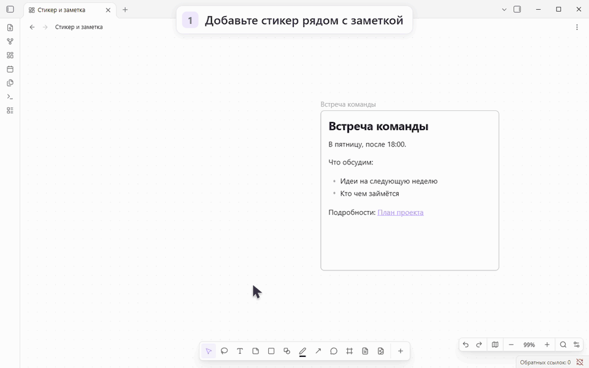

## Содержание

- [С чего начать](#с-чего-начать)
- [Заметки и ссылки Obsidian](#заметки-и-ссылки-obsidian)
- [Карточки, фигуры и фреймы](#карточки-фигуры-и-фреймы)
- [Оформление](#оформление)
- [Стрелки и рисование](#стрелки-и-рисование)
- [Комментарии и блокировка](#комментарии-и-блокировка)
- [Поиск и перемещение по доске](#поиск-и-перемещение-по-доске)
- [Настройка под себя](#настройка-под-себя)
- [Телефон и планшет](#телефон-и-планшет)
- [Экспорт](#экспорт)
- [Перенос из Miro и других плагинов](#перенос-из-miro-и-других-плагинов)
- [Файлы, сеть и ограничения](#файлы-сеть-и-ограничения)
- [Установка](#установка)
- [Справка, планы и разработка](#справка-планы-и-разработка)

В разделах ниже есть короткие GIF. Раскрывайте нужный пример; мелкие кнопки
удобнее рассматривать, открыв запись в полном размере.

## С чего начать

1. [Установите](#установка) и включите Miro Canvas.
2. Откройте существующий файл `.canvas` или создайте новую доску в Obsidian.
3. Выберите стикер на панели инструментов и нажмите на свободное место доски.
4. Напишите короткую мысль. Добавьте заметку из хранилища и соедините их стрелкой.
5. Выделите элемент, чтобы изменить его цвет, шрифт или форму.

Кнопки с буквами можно включать с клавиатуры, пока вы не редактируете текст:

| Клавиша | Инструмент |
| --- | --- |
| V | Выделение |
| T | Текст |
| N | Стикер |
| S | Фигура |
| P | Перо и инструменты рисования |
| L | Линии и стрелки |
| C | Комментарий |
| F | Фрейм |

**Escape** убирает выбранный инструмент и выделение. Двойное нажатие на пустое
место действует так же. **Ctrl + Z** отменяет действие; на Mac — **Cmd + Z**.
Код, таблица и ссылка на сайт доступны через **+** в конце панели.

При первом запуске можно открыть **доску знакомства**. В ней есть восемь
разделов с заданиями, настоящие файлы Obsidian и свободное место для проб.
Она открывается с приближённым вступлением; к другим разделам можно перейти
по миникарте. Доска и файлы примеров создаются в вашем хранилище и остаются
там для дальнейшей работы.

Если пропустили предложение, откройте **Настройки → Miro Canvas → Начало работы**.
Новая доска называется **Miro Canvas - Начните здесь.canvas**. Прежние доски
знакомства и уже созданные примеры не перезаписываются.

## Заметки и ссылки Obsidian

Перетащите заметку из списка файлов на доску или добавьте её кнопкой заметки
на панели. На доске показывается тот же файл: изменения заметки видны и здесь.

Добавить заметку из хранилища

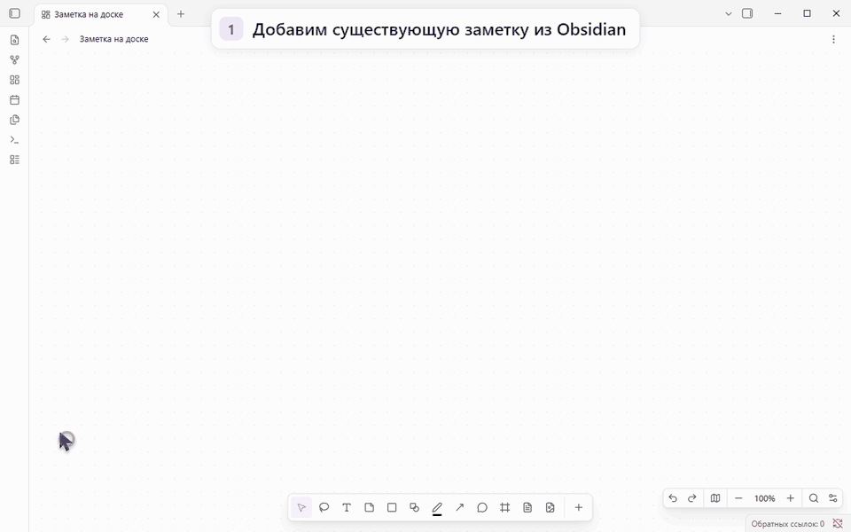

В текстовых карточках работают ссылки и встраивания Obsidian:

| Запись | Результат |
| --- | --- |
| `[[План проекта]]` | Ссылка на заметку |
| `![[План проекта]]` | Содержимое заметки внутри карточки |
| `[[План проекта#Встреча]]` | Ссылка на заголовок |
| `[[План проекта#^задача]]` | Ссылка на блок |
| `![[Подготовка.canvas]]` | Превью другой доски |

Чтобы перейти по ссылке, сначала выделите карточку, затем нажмите на ссылку.

Вставить ссылку и содержимое заметки

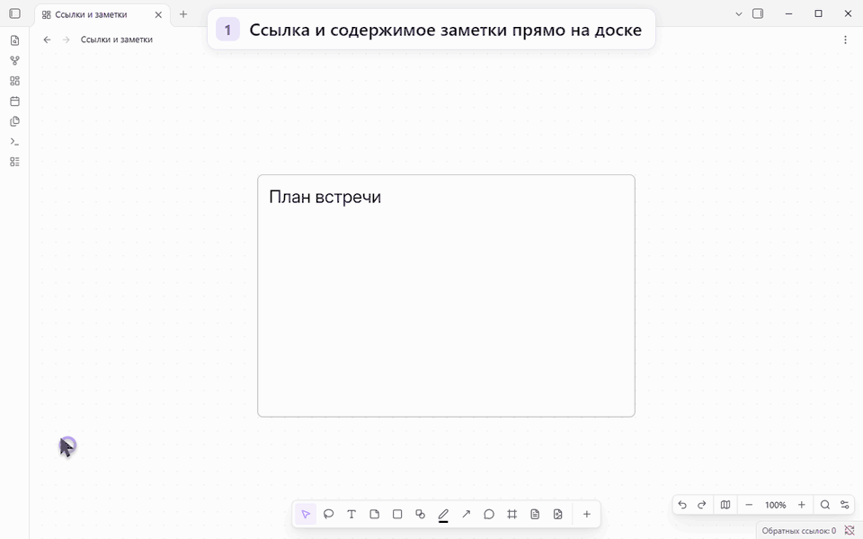

В превью другого Canvas видны расположение карточек и связи, но не текст
карточек. Нажмите на название вложенной доски, чтобы открыть её.

Показать и открыть другую доску

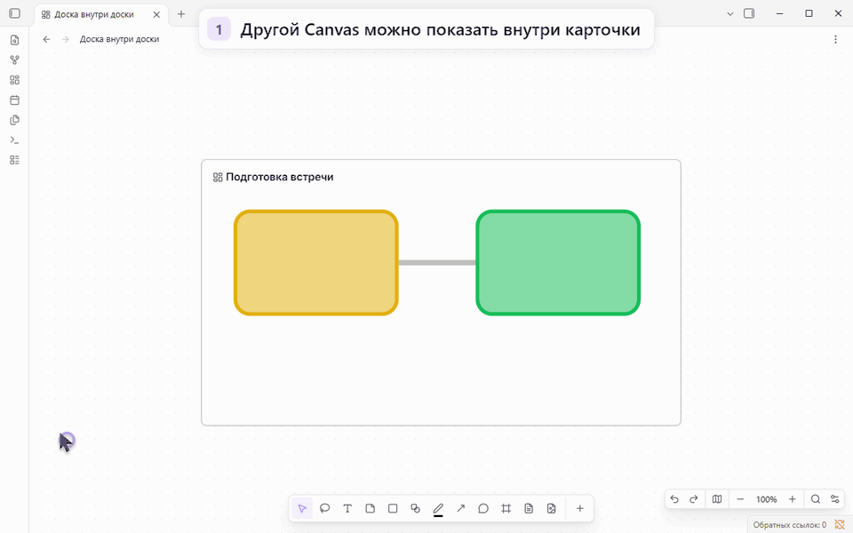

Картинки, PDF и другие файлы тоже добавляются из хранилища. Формулы и Markdown
в карточках отображает Obsidian.

## Карточки, фигуры и фреймы

Для коротких мыслей есть квадратные стикеры. Текст на них подстраивается под
размер. Для схем — прямоугольники, круги, ромбы, стрелки и другие фигуры,
включая набор для блок-схем. Подсказки в палитре объясняют назначение фигур.
Отдельный инструмент текста позволяет написать прямо на доске.

Создать фигуру с текстом

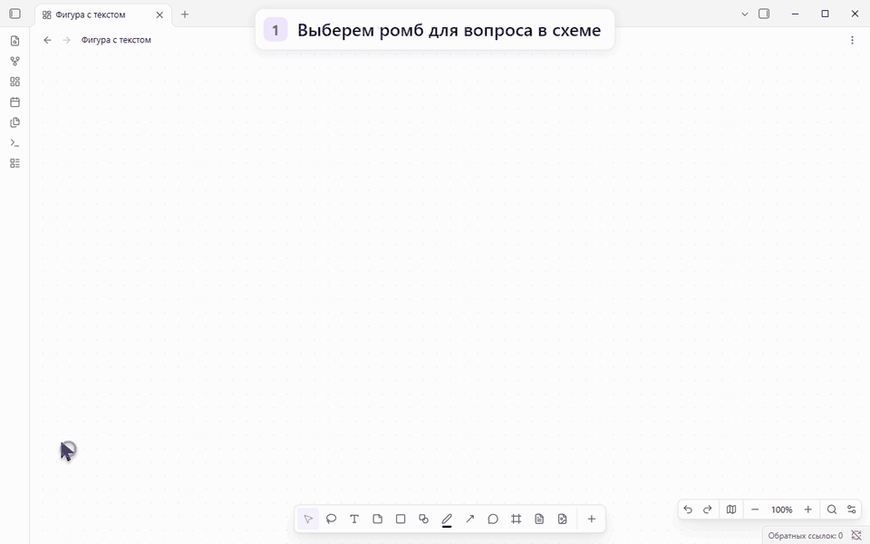

**Фрейм** — область с названием, например «Встреча» или «Следующая неделя».
Переместите его за название: элементы внутри поедут вместе с ним.

Передвинуть фрейм вместе с задачами

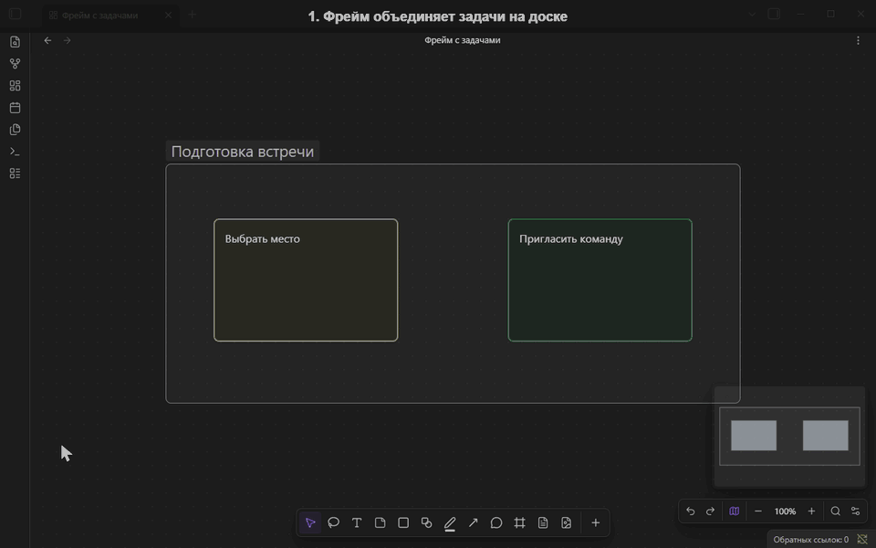

Несколько элементов можно выделить рамкой или лассо и передвинуть вместе.
Копирование и вставка между досками сохраняют оформление и поворот. Файловая
карточка при вставке ссылается на прежний файл; копия файла не создаётся.

Выделить и перенести несколько карточек

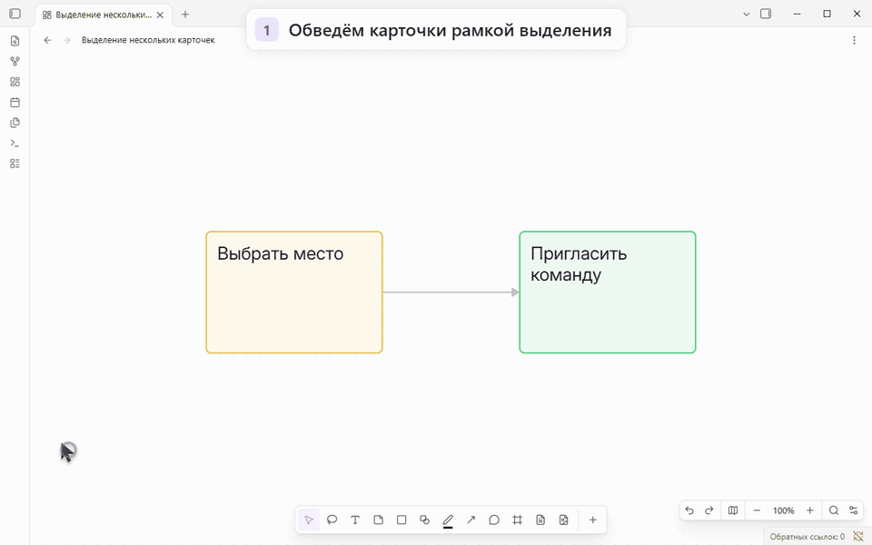

На доску также можно добавить код с заголовком, таблицу Markdown и веб-ссылку.

## Оформление

Выделите карточку: над ней появится панель. Здесь меняются форма, шрифт,
размер текста, начертание, выравнивание, межстрочный интервал, заливка и рамка.
Можно выделить слово маркером, добавить список или превратить текст в ссылку.

Изменить шрифт и цвет

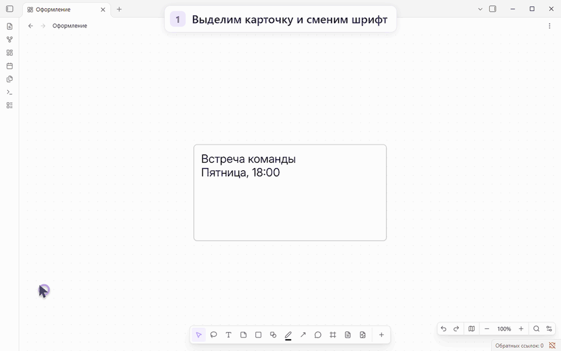

Круглая ручка под карточкой поворачивает её. С **Shift** поворот идёт шагами
по 15°. Стрелки по сторонам добавляют соседнюю карточку со связью; если
потянуть стрелку, можно провести линию к другому элементу.

Порядок наложения меняется через **Ещё** на панели или контекстное меню:
вперёд, назад, на передний или задний план. Фреймы всегда остаются под карточками.
Обычное выделение и перетаскивание не меняют порядок наложения.

## Стрелки и рисование

Выберите **L** и проведите линию между карточками. Она будет следовать за
ними при перемещении. У линии можно менять цвет, толщину, наконечники,
подпись и форму: прямая, угловая или изогнутая. Потяните середину линии,
чтобы изменить изгиб. Свободный конец можно оставить на пустом месте доски.

Передвинуть карточку со стрелкой и отменить действие

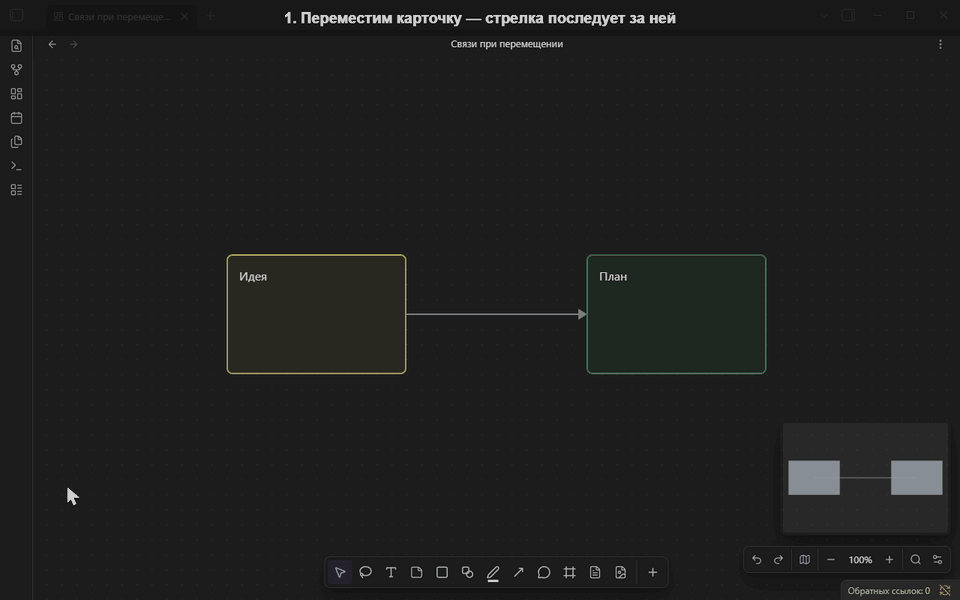

**Перо** рисует отдельные штрихи, **маркер** оставляет полупрозрачный след.
Умное рисование выравнивает наброски фигур и распознаёт стрелки. Ластик
удаляет штрих целиком или только его часть.

Нарисовать и стереть штрих

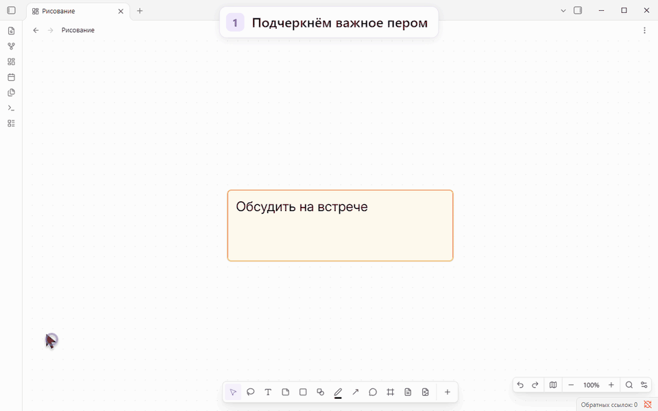

С **Shift** штрих идёт прямо. Если задержать перо в конце штриха примерно
на полсекунды, штрих тоже станет прямой линией. Это можно отключить в настройках
рисования. Повторное нажатие кнопки пера или линий скрывает их настройки;
сам инструмент остаётся выбранным.

Для подписи линии доступны те же шрифты и начертания, что для текста карточки.
Привязки помогают прикреплять концы к контуру и точкам карточек. Соединения
между самими линиями пока экспериментальные и по умолчанию выключены.

## Комментарии и блокировка

Нажмите **C** и выберите место для комментария: карточку, картинку, линию или
свободную область. Нажатие на метку открывает обсуждение. Можно ответить,
отметить вопрос решённым и позднее вернуть его в открытые. В отдельной панели
собраны комментарии всей доски или выделенного элемента.

Ответить на комментарий и решить вопрос

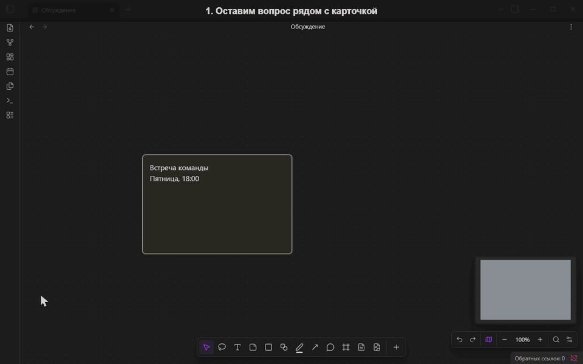

Имя и цвета авторов задаются в настройках. Комментарии, перенесённые из Miro,
доступны для чтения; при необходимости их можно скрыть. Комментарии хранятся
в файле доски. Сам плагин не передаёт их другим людям и не организует
совместное редактирование через сервер.

**Замок** защищает элемент от перемещения, изменения размера, правок и удаления.
**Режим просмотра** в меню доски защищает всю доску. При этом можно двигать
вид, открывать ссылки, копировать элементы и работать с комментариями.

## Поиск и перемещение по доске

Миникарта помогает перейти к другой части доски. Нажмите или потяните в ней.
Процент масштаба открывает варианты приближения, показ всей доски и привязки.
Кнопки рядом отменяют и повторяют действия.

**Ctrl + F** на доске открывает поиск; на Mac — **Cmd + F**. Он ищет текст
карточек, названия фреймов и файлов, подписи линий и комментарии. **Enter**
переходит к следующему совпадению, **Shift + Enter** — к предыдущему.
**Escape** закрывает поиск. Поиск также доступен по кнопке с лупой.

Найти карточку за пределами экрана

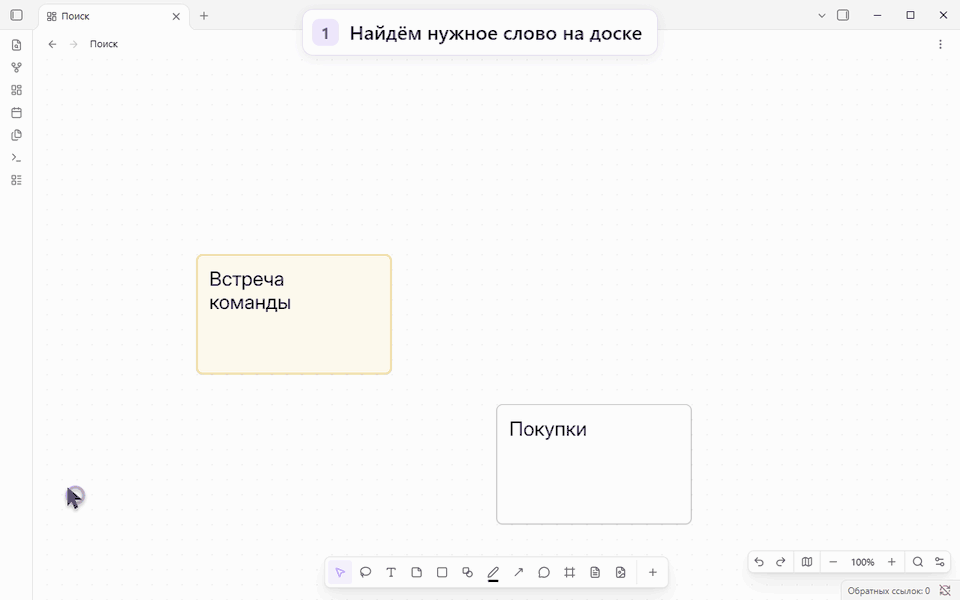

Во время редактирования текста Ctrl + F ищет внутри карточки, как обычно
в Obsidian. Поиск по доске не изменяет содержимое и работает в режиме просмотра.

## Настройка под себя

Шестерёнка открывает меню доски. В **Настроить панели** можно переместить
панель инструментов, кнопки навигации и миникарту, расположить панель строкой
или столбцом, переставить инструменты и убрать лишние под **+**.
**Готово** или Escape заканчивают настройку, **Вернуть как было** возвращает
исходное расположение.

Переместить панель и поставить её сбоку

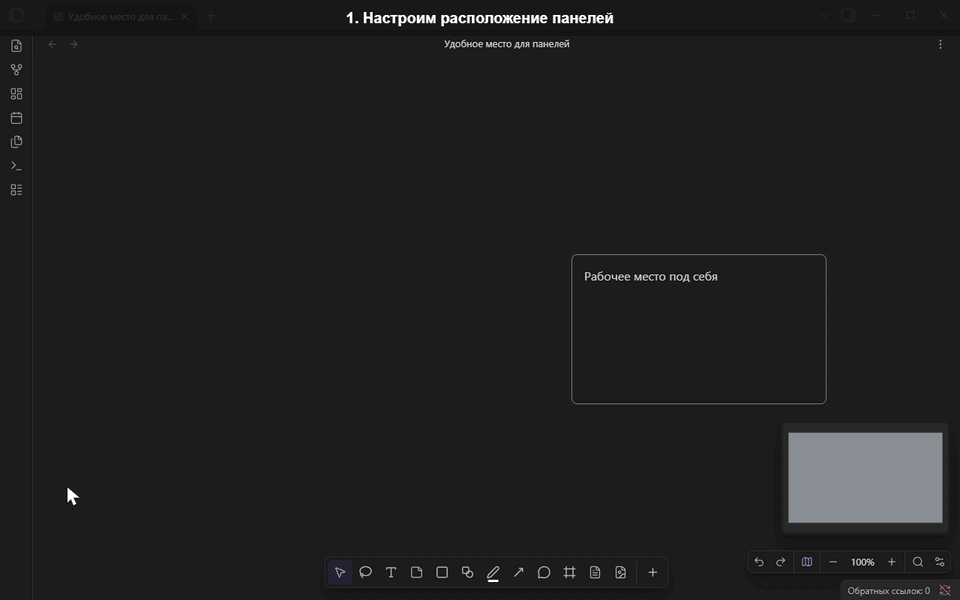

Расположение панелей и набор кнопок сохраняются отдельно для компьютера,
планшета и телефона. Например, на планшете можно поставить панель сбоку,
а на компьютере оставить внизу. В узком окне стандартные панели уступают
друг другу место; своё расположение вы выбираете сами.

В настройках также можно выбрать тему доски, диапазон и шаг масштаба,
поведение колёсика и привязок, видимость миникарты и имён вложений.
Интерфейс следует языку Obsidian: доступны русский и английский.

**Шрифты.** Можно добавить файл `.ttf`, `.otf`, `.woff` или `.woff2`, выбрать
шрифты для панели и изменить их порядок. Готовые наборы включают шрифты Miro,
Excalidraw и открытые аналоги распространённых шрифтов Word. Набор скачивается
только после нажатия **Скачать**; скрытие шрифта из списка не удаляет его файл.

## Телефон и планшет

На Android используются те же доски. Расположение панелей и набор кнопок
сохраняются отдельно для телефона, планшета и компьютера. На маленьком
экране можно оставить снизу только частые инструменты, а навигацию поставить
сбоку. Остальные инструменты доступны через «+». Миникарту можно скрыть. Пока открыта экранная клавиатура, нижние панели убираются;
панель оформления остаётся рядом с редактируемой карточкой.

Один палец на пустом месте двигает доску, два пальца меняют масштаб.
Выделенную карточку можно сразу тянуть; для невыделенной сначала задержите
палец, затем потяните. Долгое нажатие открывает меню карточки, а на пустом
месте начинает выделение рамкой.

На телефоне: перенести карточку пальцем

На телефоне: передвинуть и приблизить доску

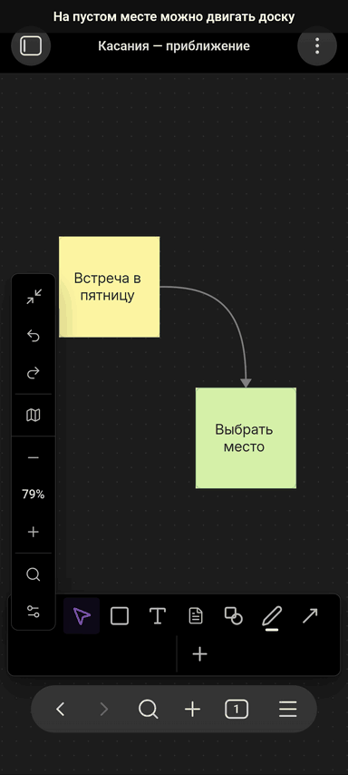

На телефоне: поставить навигацию сбоку

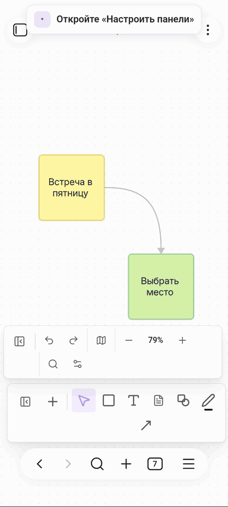

На планшете можно поставить инструменты столбцом у левого края, а навигацию
оставить снизу. Настройки пера и линий открываются рядом с вертикальной
панелью. Это один из вариантов: панели можно передвинуть и повернуть под себя.

На планшете: перенести карточку пальцем

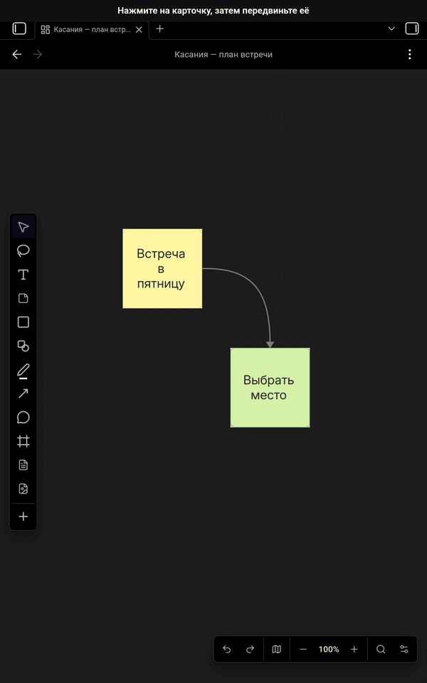

На планшете: передвинуть и приблизить доску

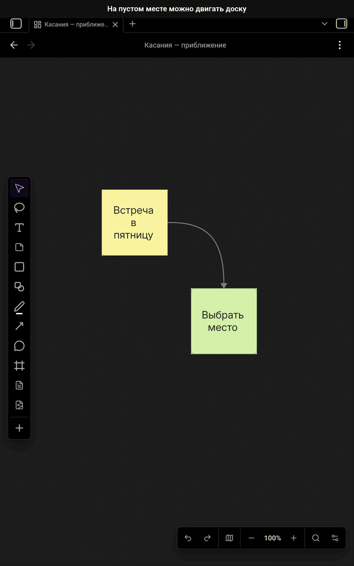

На планшете: поставить инструменты столбцом

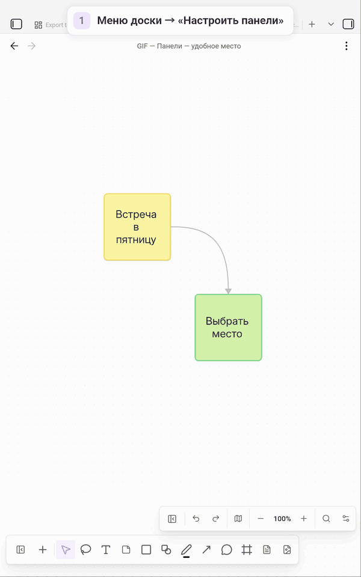

Перо поддерживает изменение толщины от нажима. Пока выбран инструмент
рисования, пальцем можно двигать доску; защита от касаний ладонью учитывает
присутствие пера. Работа зависит от того, какие события передаёт устройство.
Боковая кнопка S Pen в проверенной версии Obsidian до плагина не доходит.

Мобильные записи сделаны на Samsung SM-X736B и Galaxy A33 (SM-A336E).
Касания передавались через Android, жест двумя пальцами — через WebView.
Эти записи не проверяют настоящий нажим пера или касание ладонью.
iPhone, iPad, macOS и Linux в этой серии не проверялись.

## Экспорт

На компьютере откройте шестерёнку → **Экспорт в PDF или PowerPoint**.
Отметьте страницы на доске: их можно двигать и менять размер. Кнопка
**Страница на каждый фрейм** размечает их автоматически. Доступны A4, A3,
Letter, 16:9, 4:3, свой размер и выбор ориентации. Разметка сохраняется с доской.

Разметить страницы и сохранить PDF и PowerPoint

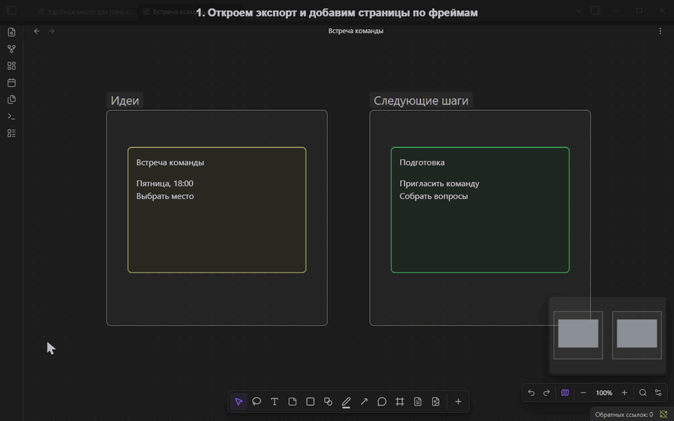

[PDF](docs/media/ru/export-example.pdf) · [PowerPoint](docs/media/ru/export-example.pptx)

Каждая страница PDF и каждый слайд PowerPoint содержат **изображение доски**.
Текст и фигуры в PowerPoint не становятся отдельно редактируемыми объектами.
Экспорт PDF/PPTX доступен в Obsidian на компьютере.

## Перенос из Miro и других плагинов

Для досок Miro используется отдельная программа
[miro2obsidian](https://github.com/NixWrk/Miro_2_Obsidian). Она выгружает данные
Miro и создаёт файлы в хранилище; Miro Canvas отображает получившиеся доски.

Откройте **Настройки → Miro Canvas → Открыть руководство по импорту**.
В нём описаны установка программы, создание приложения Miro и выгрузка
в формате **miro-canvas**. Есть и готовый запрос для ИИ-агента. Сам плагин
не устанавливает и не запускает программу переноса.

Excalidraw, списочные карты Enhancing Mindmap и Markmind, а также Advanced
Canvas импортируются командой **Импортировать в доску**. Она доступна
в меню файла и палитре команд. Сначала открывается предварительный просмотр:
что перенесётся и где появится новая доска. Исходный файл сохраняется без изменений.

Часть оформления может отличаться. Например, штриховка Excalidraw не переносится,
расположение интеллект-карты строится заново, а группы Advanced Canvas
показываются развёрнутыми. О неточностях сообщает отчёт рядом с доской.
[Полный список возможностей и ограничений импорта](docs/import.ru.md).

## Файлы, сеть и ограничения

Доска остаётся файлом `.canvas` в вашем хранилище. С выключенным плагином её
можно открыть в обычном Canvas: карточки, файлы и обычные связи сохраняются.
Оформление, комментарии и свободные линии Miro Canvas хранятся дополнительно
и для отображения требуют плагин. Импортированные данные Miro сохраняются
в файле как источник; при редактировании плагин их не меняет.

Для редактирования доски подключение к интернету не требуется. Плагин обращается
к GitHub для проверки нового выпуска — не чаще раза в день при запуске —
и для загрузки набора шрифтов по нажатию. Проверку обновлений можно отключить
в настройках. Она сообщает о новой версии, но не устанавливает её.

Веб-ссылки и встроенные веб-страницы могут обращаться к своим сайтам через
Obsidian. BRAT, Obsidian Sync и другие плагины используют сеть по своим правилам.

Помимо ограничения экспорта на мобильных устройствах, остаются такие ограничения:

- Таблицы из Miro приходят без текста ячеек: его нет в используемой выгрузке.
- Соединения линий с другими линиями экспериментальные и выключены по умолчанию.
- На досках с тысячами карточек перенос большого выделения может быть медленным.
- Полная проверка всех устройств и всех видов ссылок ещё не закончена.

## Установка

**Через BRAT.** Этот плагин устанавливает выпуски с GitHub и может обновлять их.

1. В **Настройки → Сторонние плагины** установите и включите **BRAT** от **TfTHacker**.
   Если сторонние плагины заблокированы, сначала выйдите из ограниченного режима.
2. В палитре команд выполните **BRAT: Plugins: Add a beta plugin for testing
   (with or without version)**.
3. В поле **Repository** вставьте `NixWrk/Obsidian-Plugin---Miro-Canvas` и нажмите Tab.
4. Выберите **Latest version**, оставьте **Enable after installing the plugin**
   и нажмите **Add plugin**. Выпуски `fonts-…` содержат наборы шрифтов, а не плагин.

Автоматическое обновление управляется настройками BRAT. Если GitHub сообщает
о превышении лимита запросов, подождите указанное время и повторите попытку.

**Вручную.** Скачайте `main.js`, `manifest.json` и `styles.css` из
[последнего выпуска](../../releases/latest), поместите их в
`<хранилище>/.obsidian/plugins/miro-canvas/` и включите **Miro Canvas**
в сторонних плагинах. Для обновления замените эти три файла.

## Справка, планы и разработка

[Справка по командам и настройкам](docs/reference.ru.md) содержит полный список
инструментов и команд. [Планы и устройство плагина](docs/miro-canvas.ru.md)
описывают текущие задачи. [Обзор записей](docs/visual-guide.md) показывает,
что уже проверено и что ещё предстоит снять.

Открыты проверка разных ОС и устройств (`FUT-010`), полный наглядный справочник
(`FUT-012`), проверка всех ссылок и формул (`FUT-017`) и путь нового пользователя
от установки до переноса доски (`FUT-004`). Среди доработок — большие выделения
и соединения между линиями. Наличие GIF отдельной функции не означает,
что вся задача закрыта.

Исходный код собирается командами `npm ci`, `npm run check`, `npm test` и
`npm run build`. Подробности проверок и выпуска — в
[руководстве для разработчиков](docs/contributing.ru.md).

### Работа с репозиторием через ИИ-агента

Перед изменениями прочитайте [AGENTS.md](AGENTS.md) и
[правила работы, выпуска и записи GIF](docs/contributing.ru.md).
Для чтения и изменения досок есть [MCP-сервер](mcp/README.md) и
[навык miro-canvas-format](.agents/skills/miro-canvas-format/SKILL.md).
Сервер запускается отдельно по настройке владельца; плагин его не запускает.

## Лицензия

[MIT](LICENSE).
