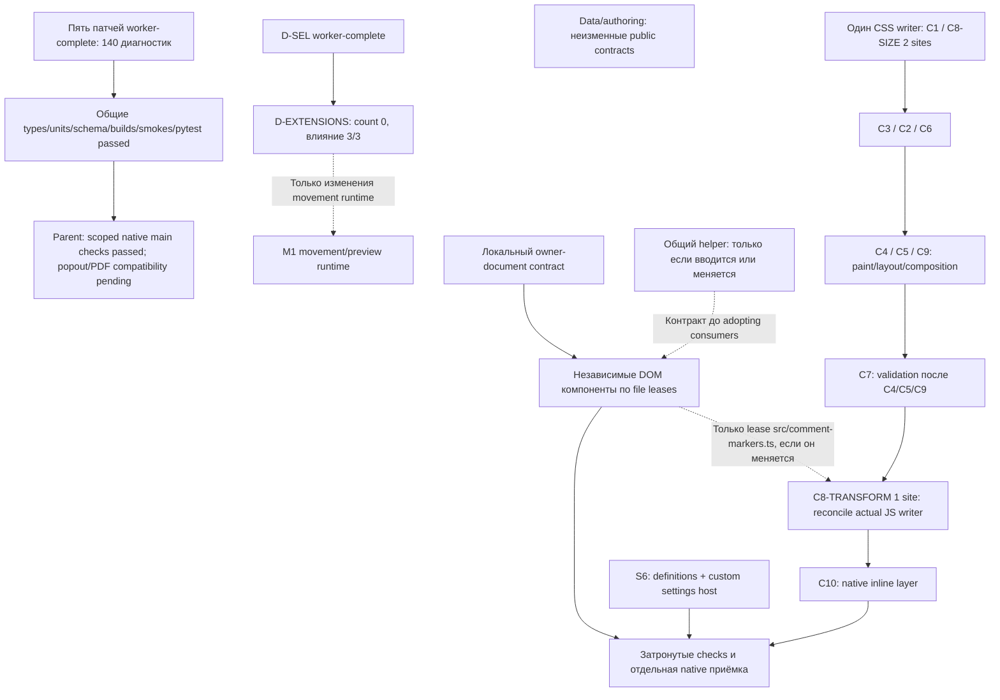

# План исполнения L20: финальные свидетельства и границы приёмки

**На frozen assets приняты или dispositioned все 47 jobs.** Финальная проверка
D-EXTENSIONS прошла на Windows, планшете и телефоне: смешанное/групповое
выделение, захваченные концы и прикреплённая цепочка линий, до отпускания,
при 50%/125%, с повторным перемещением, отменой и Undo/Redo. Общие gates
закрыты в записанных границах свидетельств; более широкие непроверенные
ручные сценарии перечислены отдельно ниже.

База назначения — **85cb6cd**, implementation L20 — **2f3687c**. Неизменный
[снимок](lint-remaining-sites.json) и [JSON ledger](lint-execution-plan.json)
сохраняют **47 jobs, 46 уникальных направленных рёбер и 438 уникальных indices**.
D-EXTENSIONS и P-PDFCOMPAT — два semantic jobs с count 0. История L19, её hashes,
wave1 и исходное распределение сохранены; текущий результат supersedes прежние
pending-заметки, но не переписывает их как состоявшийся тогда PASS.

## Документационный scope и trace до правки

Эксклюзивная запись — только этот Markdown и JSON плана в shared PRIMARY checkout.
До правки прочитаны AGENTS/workflow, contributing/design notes, новые записи
[центрального реестра](lint-remediation-checks.md#l20--integrated-evidence-on-the-frozen-build-2026-10-06), final worker receipts и ignored JSON evidence.
Действие — перенести точные финальные результаты в текущие статусы и отделить
ожидаемый selection receipt от практических непроверенных сценариев. Проверки
этой правки: граф/assignments/арифметика, сохранность истории и frozen hashes,
существование evidence references, UTF-8 без BOM, CRLF и scoped diff check.
Sidecar не запускал приложения, source checks, tests, lint, сборки или devices;
ниже приведены результаты parent/worker запусков, а не новые собственные запуски.

## Frozen assets и общие gates

Freeze parent: **2026-10-06T19:58:00Z**. Integrated commit — **содержащий
commit**: его собственный hash не вписывается в документ во избежание циклического
self-hash. Sidecar не создаёт commit. Четыре ранее заполненных hashes сохранены:

| Asset | SHA-256 |
| --- | --- |
| main.js | aff2ee3a34a3045a30075c5736091c5cde937e3e06d2c1d327659ae5705aa200 |
| styles.css | 7c5ce8c141b048ae4382abb83f6c3a309a0bfef5c21290bc527184202a76208c |
| manifest.json | 68169dd642f5654f4a1c3fdf0f64510dd5dba5a72c9d9a3abf39f1a6d4f1c174 |
| MCP bundle | 4c69150dc6398649a43fae27a2fdbf1d53e2e6a08e096022ed4adef74ccb9618 |

[Полные integrated gates](lint-remediation-checks.md#l20--integrated-evidence-on-the-frozen-build-2026-10-06) — **PASS**: types; 126 Vitest files,
**2036 passed + 1 существующий optional skip**; 33 oracle pytest;
три synthetic smoke suites; schema pin; plugin/MCP builds; submission packaging;
plugin lint 0 errors/1 warning, standalone MCP lint 0/0, CSS 0 priorities/0 :has.
Typed-ESLint cold-start test получил 30s вместо прежних 5s; product deadlines
не менялись. Module/type-only equality receipts не являются whole-bundle identity:
L20 включает отдельно проверенные intentional runtime repairs.

## Неизменная арифметика diagnostics

| Область | Baseline | Финальный результат | Disposition |
| --- | ---: | --- | --- |
| src | 332 | 1 warning, 0 errors | W259, literal m1-commands для прежних hotkeys; actual trusted hotkey PASS |
| CSS | 83 | 0 priorities, 0 :has | Normal cascade и reversible inline ownership; final native PASS |
| Standalone MCP | 23 | 0 warnings / 0 errors | Enforced Node server runtime |
| MCP в raw plugin-context | те же 23 | 11 = 9 warnings + 2 errors | 8 Node imports, 2 stderr redirects, 1 explicit config default |

**438 = 426 отсутствующих raw diagnostics + 11 необходимых Node-runtime
scope dispositions + 1 legacy command warning.** Effective enforced scopes дают
1 warning; raw contexts суммарно дают 12. Это не заявление об удалении каждой
legacy source-операции. Все W001–W438 / indices 0–437 и owner totals
**90/65/5/32/35/188/23 = 438** сохранены. Settings James и часть U-DOM Helmholtz
имеют отдельную implementation attribution без переназначения baseline sites.

## Текущая приёмка всех 47 jobs

Колонка diagnostics: effective / retained raw MCP plugin-context. «Принято» означает
bounded lint-remediation acceptance по worker proofs, integrated gates и применимым
installed receipts; непроверенные более широкие сценарии перечислены ниже.

| Job | Исходный owner | Baseline sites | Diagnostics effective / raw MCP | Текущая приёмка |
| --- | --- | ---: | ---: | --- |
| A-RECORDS | authoring | 7 | 0 / 0 | Принято |
| D-RECORDS | data | 10 | 0 / 0 | Принято |
| D-VALID | data | 11 | 0 / 0 | Принято |
| F-VALID | foundation | 2 | 0 / 0 | Принято |
| F-RECORDS | foundation | 1 | 0 / 0 | Принято |
| F-TYPES | foundation | 2 | 0 / 0 | Принято |
| U-DOM | interface | 96 | 0 / 0 | Принято |
| U-CONTEXT | interface | 2 | 0 / 0 | Принято |
| D-SEL | data | 69 | 0 / 0 | Принято |
| D-EXTENSIONS | data | 0 | 0 / 0 | Принято по трём native hosts |
| A-AUTH | authoring | 58 | 0 / 0 | Принято |
| P-CONTEXT | platform | 3 | 0 / 0 | Принято |
| U-TEXT | interface | 1 | 0 / 0 | Принято |
| P-DOM-PROBE | platform | 1 | 0 / 0 | Принято |
| P-DOM | platform | 4 | 0 / 0 | Принято |
| U-RECORDS | interface | 1 | 0 / 0 | Принято |
| K-CONTEXT | core | 2 | 0 / 0 | Принято |
| K-RECORDS | core | 16 | 0 / 0 | Принято |
| K-DOM | core | 13 | 0 / 0 | Принято |
| K-SEARCH | core | 1 | 0 / 0 | Принято |
| K-TEXT | core | 1 | 0 / 0 | Принято |
| K-CLIPBOARD | core | 1 | 0 / 0 | Принято с disposition |
| K-GUARDS | core | 1 | 0 / 0 | Принято |
| P-VALID | platform | 1 | 0 / 0 | Принято |
| P-ID-TEXT | platform | 3 | 1 / 0 | Принято с disposition |
| P-LEAF | platform | 11 | 0 / 0 | Принято |
| P-TIMERS | platform | 5 | 0 / 0 | Принято |
| P-PDFCOMPAT | platform | 0 | 0 / 0 | Принято |
| U-SETTINGS | interface | 5 | 0 / 0 | Принято |
| P-RENDER-DATA | platform | 4 | 0 / 0 | Принято |
| U-C5 | interface | 26 | 0 / 0 | Принято |
| U-C2 | interface | 2 | 0 / 0 | Принято |
| U-C1 | interface | 3 | 0 / 0 | Принято |
| U-C4 | interface | 39 | 0 / 0 | Принято |
| U-C3 | interface | 3 | 0 / 0 | Принято |
| U-C6 | interface | 1 | 0 / 0 | Принято |
| U-C7 | interface | 2 | 0 / 0 | Принято |
| C8-SIZE | interface | 2 | 0 / 0 | Принято |
| C8-TRANSFORM | interface | 1 | 0 / 0 | Принято |
| U-C9 | interface | 3 | 0 / 0 | Принято |
| U-C10 | interface | 1 | 0 / 0 | Принято |
| M-M1 | mcp | 9 | 0 / 8 | Принято с disposition |
| M-M4 | mcp | 6 | 0 / 0 | Принято |
| M-M5 | mcp | 1 | 0 / 0 | Принято |
| M-M2 | mcp | 2 | 0 / 2 | Принято с disposition |
| M-M3 | mcp | 4 | 0 / 1 | Принято с disposition |
| M-M6 | mcp | 1 | 0 / 0 | Принято |

[DATA](lint-workers/l20-data.md), [AUTHORING/DOM](lint-workers/l20-authoring-dom.md),
[FOUNDATION/settings](lint-workers/l20-foundation-settings.md),
[PLATFORM](lint-workers/l20-platform.md), [INTERFACE/CSS](lint-workers/l20-interface.md)
и [MCP](lint-workers/l20-mcp.md) сохраняют scoped patches, module/plain-JS proofs,
focused tests и подробные dispositions. MCP receipt: 183 focused tests, 10 real
bounded stdio subprocesses. Финальные full gates подтверждены отдельно parent.

## Installed native evidence на текущих assets

**Windows 1.14.4:** [все восемь матриц](../tools/obsidian_cdp/.out/l20-windows-final/summary.json) PASS: native style owners,
hidden roots, visibility/capture, CSS/resize/labels, timer/PDF, card fill, font failures,
arrow colors. [Restoration](../tools/obsidian_cdp/.out/l20-windows-final/restoration.json) сохраняет exact original board,
один hidden/unfocused main window и отсутствие дочерних окон. [Style proof](../tools/obsidian_cdp/.out/l20-native/styles-Windows.json)
положительно подтверждает ordinary M1 **1→1** и Source **5→5** после 100 замен
каждого preview; прежний count0 gap этим superseded, не переименован в старый PASS.
Обе темы, late Markdown 18px writer, paint/menu competition, group class-only state,
latest external values/priorities и неизменные source/extensions/history проверены.
Pure-helper actual-host CSSOM и [132 variants / 48,816 synthetic comparisons](../tools/obsidian_cdp/.out/l20-interface/css-transfer/final-proof.json)
остаются отдельными типами evidence: matched 83 sites, 0 mismatches; helpers-off 162.

[Windows settings](../tools/obsidian_cdp/.out/l20-authoring-dom/settings-navigation-desktop-background.json) PASS: 12 sections, trusted renderer navigation,
строгий fresh welcome witness, export help и exact post-action bytes.
[Trusted hotkey](../tools/obsidian_cdp/.out/l20-hotkey-proof.json) Ctrl+Alt+F10 открыл commands modal через сохранённый
miro-canvas:m1-commands; временная in-memory mapping, прежний hotkeys file и board
восстановлены. Это подтверждает compatibility disposition одного raw warning.

[Actual Windows clipboard](../tools/obsidian_cdp/.out/l20-native/clipboard-Windows.json) PASS: trusted native copy/paste/cut,
Canvas MIME, source/unknown/per-card overrides, one-step history и Undo/Redo.
Исходные formats/payloads восстановлены и проверены, не записывались в logs.
Parent дополнительно сообщает **39 focused clipboard units PASS**. Guarded synchronous
legacy execCommand сохранён: это проверенная compatibility, не async API migration.

[Native export](../tools/obsidian_cdp/.out/l20-export-followup-Windows.json) PASS: настоящий two-page PDF, trusted Stop и
forced save-callback failure после actual capture. Exact camera/document,
screenshotting flag, capture classes, progress и оба export roots восстановлены;
cancel/failure не создали дополнительного PDF. Callback failure был инъекцией,
не наблюдением настоящей disk error.
[Native PDF/popout](../tools/obsidian_cdp/.out/l20-pdf-popout.json) PASS: actual two-page main и hidden native popout,
page-width/page-fit, правильный ownerWindow; already-closed view возвращает false.
Шесть принудительных readiness stages завершились false при **реальном закрытии
native окна**, без late fit writes. Report измеряет примерно 166–185ms; facades
явно instrumented. Timer matrices подтверждают currentFit=true и diagnostics=[];
owner receiver, общий 2000ms deadline, rejection/late-ready и native lifecycle
guards сохранены. Старый baseline early-read boolean — только информация;
прежний вывод «private capabilities отсутствуют» более не описывает текущий результат.

**Tablet SM-X736B / Obsidian 1.13.8:** [все десять матриц](../tools/obsidian_cdp/.out/l20-tablet-final/completed-summary.json) и
[positive M1 proof](../tools/obsidian_cdp/.out/l20-tablet-final/native-style-owners.positive-M1.pass.json) PASS; settings 12 sections с реальным ADB
navigation и отдельно отмеченным CDP Tab. [Worker receipt](lint-workers/l20-tablet-final.md)
сохраняет model/serial/input и exact board/theme/data.json/installed hashes restoration.
Fresh Picture.png единожды принимает **height160→133 при width200**, natural480×320,
ratio1.5, только **до action baseline**: [L19/L20/disabled-native diagnosis](../tools/obsidian_cdp/.out/l20-tablet-final/height-profiles-report.json)
доказывает одинаковую native image aspect normalization. Все прочие saved/native
fields, source/unknown/nested arrays остаются strict; пять stable full snapshots
предшествуют действиям, post-export/close bytes и original board strict.
Это не production data repair и не широкое исключение height.

**Phone SM-A336E / Obsidian 1.12.7:** [все девять матриц](../tools/obsidian_cdp/.out/l20-phone-final/receipt.json) и
[positive M1 proof](../tools/obsidian_cdp/.out/l20-phone-final/native-style-owners/l20-native/styles-RZCW101PJVN.json) PASS, включая drawing/hold/shape и точную
restoration. [Worker receipt](lint-workers/l20-phone-final.md) отделяет real ADB
от CDP setup/pressure. Версия ниже minimum1.13.7: supported declarative settings
**исключены**, новая settings compatibility для 1.12.7 не заявляется.

## Непроверенные более широкие сценарии

[Финальная приёмка D-EXTENSIONS](lint-workers/l20-data-native.md) PASS на всех
трёх hosts: четыре cases, восемь commits и четыре held cancels на каждом.
Native/independent/chain paths и pins следуют до release; source/unknown fields,
невыделенные дальние концы, history и точные сохранённые bytes проверены.
Captured masks подготовлены API; это не сертификация физического marquee.
Parent завершил input после закрытия исполнителя; прежние неудачные попытки
не переименованы в PASS. Reports: selection-native-{windows,tablet,phone}-chain-final.json
в ignored tools/obsidian_cdp/.out/l20-data/.

- **Android happy clipboard roundtrip НЕ СЕРТИФИЦИРОВАН.** Chromium/WebView read
  denied до создания fixture и любых clipboard writes; [attempt](../tools/obsidian_cdp/.out/l20-native/clipboard-R52Y808PDJB.json)
  не даёт успешной clipboard restoration/roundtrip сертификации. Без безопасного
  arbitrary-format backup destructive alternative не запускалась.
  [Отдельные реальные tablet ADB Cut missing/false/throw checks](../tools/obsidian_cdp/.out/l20-native/clipboard-R52Y808PDJB-failures.json)
  PASS: graph/history неизменны, clipboard event отсутствует, correct receiver,
  existing notice и descriptors/callback/original board restored. Failure guards
  остаются прежними; успешный Android system roundtrip этим не доказывается.
- Real hardware pressure, физический stylus/palm/hover не проверены. ADB
  stylus-source и synthetic CDP pressure — разные, ограниченные свидетельства.
- Windows OS input/foreground/compositor и system pickers/native dropdown popup
  не сертифицированы. Trusted background renderer events не становятся OS input.
- Полный mounted UI/action provenance всех шести модулей в popout не доказан.
  [DOM receipt](lint-workers/l20-dom-native.md) + pure factory main/iframe/hidden-popout probes
  и actual PDF popout fit/close не заменяют эту более широкую проверку.
- Forced readiness/rejection/late-ready и forced export save callback не являются
  естественными native viewer/disk failures. Публичная совместимость всех будущих
  private viewer shapes не заявляется; existing fail-closed fallback остаётся.

## Follow-ups и исторические записи

WELCOME-MAIN-WINDOW-ORDER **closed без product patch**: actual native getData
сортирует top-level nodes по zIndex одинаково на L19/L20/disabled-native; каждый
card field, source/extensions, nested array order и exact file bytes сохранены.
Отдельная fresh tablet image normalization теперь доказана и принята только до
strict action baseline. Deferred native style-owner follow-up **accepted** по
финальным трём hosts с положительным M1 retention. Это два count-zero follow-ups
вне 438-site/47-job arithmetic, не новые assigned jobs.

MCP-LINT-GUARD-HARDENING имеет disposition **not-required-for-current-runtime**: syntax guards имеют
alias/callee/config-template/inline-disable escape possibilities и console-property
false positive. Runtime-scope disposition не заявляет security confinement;
новый hardening patch этим документационным scope не создаётся.

Статическая проверка сохраняет 47 jobs, 46 unique directed edges (включая conditional),
DAG и 438 indices; **46 accepted/dispositioned + 1 pending**. Ниже — неизменный
архив L19: queued/pending, старые hashes и прежняя PDF-интерпретация описывают тот
момент. Актуальные статусы выше и в JSON supersede эти записи, не исправляя историю.

## Архив планирования и evidence L19

Следующий исходный текст сохранён для истории L19. Его «текущий», queued, freeze
и PDF-unsupported формулировки относятся к тому checkpoint, а не к L20.
Историческая PDF inference ограничена пояснением выше; финальная L20 приёмка
находится в pending таблице, а не в старых passed/hash строках.

База назначения — `85cb6cd`, снимок [438 мест](lint-remaining-sites.json).
[Машинный план](lint-execution-plan.json) сохраняет каждое исходное место
ровно один раз: **47 jobs, 46 уникальных направленных рёбер, без циклов**,
включая проверку всех условных рёбер. 45 jobs распределяют 438 диагностик;
дополнительные D-EXTENSIONS и P-PDFCOMPAT имеют count 0 и не увеличивают исходный счётчик.
Пять implementation jobs волны 1 имеют статус `worker-complete`, а приёмка
затронутых scoped native/main checks — `integrated-scoped-native-main-checks-passed`.
Popout и PDF compatibility имеют отдельные pending результаты.

Этот документ уточнён по [аудиту интерфейса](lint-workers/interface-dependencies.md)
и [результатам интеграции L19](lint-remediation-checks.md#l19-integrated-evidence-and-remaining-checks-2026-10-06).
Структура плана проверена отдельно от исходников и приложений.

Перед каждым следующим пакетом фиксируются точный участок изменений,
обязательные проверки и единственный владелец затронутых файлов. Во время
проверок приложений используется одна неизменная сборка.

### Текущий результат и счётчики

| Область | База | Текущий checkpoint | Статус свидетельства |
| --- | ---: | ---: | --- |
| src / ESLint | 332 диагностик | 198 warnings, 0 errors | Общая интеграционная проверка L19 |
| CSS | 83 priorities | 83 priorities, 0 :has | CSS в волне 1 не исправлялся |
| Отдельный MCP | 23 диагностик | 17 диагностик | Fresh Node-scoped pass: 15 warnings + 2 intentional errors |
| **Итого** | **438** | **298** | **438 − 140 = 298 = 198 + 83 + 17** |

17 MCP диагностик — 15 warnings и 2 intentional errors отдельного Node-scoped
набора. Это не src warnings и не свидетельство нулевых MCP ошибок. В L19
выполнен свежий whole-MCP diagnostic run; это больше, чем один MCP build.
В ledger остаются все 438 назначений, включая завершённые jobs; статус результата
и текущие live counts хранятся отдельно от исходного количества assigned sites.

Проверка типов, тесты (`1800 passed + 1 skip`), схема, сборки плагина/MCP,
три синтетических сценария и pytest **прошли в общей интеграции L19**.
Все три существующие матрицы прошли на трёх устройствах:
Windows hidden CDP renderer и Android ADB на обоих Samsung. Новый
check-timer-owners.mjs прошёл lifecycle probe с actual plugin private callback,
real native leaf switch/unload/reload, same host и неизменными байтами исходной доски.
Это scoped main/native evidence; Windows input не является OS-window input.

Real PDF view opens/reuses прошли, но private fit fields unsupported на всех
трёх hosts: baseline 85cb6cd и current applyNativePdfFit оба возвращают false,
одинаковый native fallback и две diagnostics. **Automatic PDF fit не считается
успешным.** Timeout/forced reject проверены в actual owner window через
synthetic facade (2000ms, clean); это не реальный native viewer failure.
Popout pending; OS window input не выполнялся. Непроверенные сценарии остаются в очереди отдельно от прошедших.

Текущий immutable main SHA:
`bf411cff362b65d021dc2779e8f72e0411a0ea1d32602e316bf5c71fa6fc7cc0`.
CSS unchanged, SHA
`572acf04c0fc163ebeba19847f34d29441b901756bec23e722164424bb3eff28`.
После freeze код не меняется. Type-only часть имеет byte-identical whole plain plugin
JS (SHA prefix `378f...`); minified AST: 394946 nodes, только 216 identifier
occurrences с consistent bijective renames, без других изменений. Whole MCP
byte-identical (SHA prefix `ed94...`). Полные SHA и область сравнения приведены в реестре L19.

### Степень влияния

Оценка изменения и последствий ошибки различается. У type-only правки может
быть нулевое изменение runtime, но её участок — история и данные доски.

| Уровень изменения | Содержание | Условие приёмки |
| --- | --- | --- |
| 0 | Аннотации/alias/assertion либо обоснование отдельной среды MCP | Идентичный emitted JS и публичные контракты; minifier отдельно |
| 1 | Локальная граница данных или создание DOM | Существующие проверки, документ-владелец, классы/атрибуты/события сохранены |
| 2 | Окна/таймеры, validation, настройки, CSS/геометрия, lifecycle | Поведенческие тесты и затронутые действия в настоящем Obsidian |
| 3 | Пути, совместимость команды, буфер, persistence/сохранение | Дополнительно отказ/stale/locks/source/unknown fields, rollback/history |

Последствия ошибки: 1 — отдельный текст/компонент; 2 — взаимодействие/окно;
3 — данные, история, блокировки, платформа или протокол. D-EXTENSIONS имеет
changeImpact 3 и failureImpact 3 независимо от нулевого количества warnings.

### Владельцы и завершённая волна 1

Назначенное количество — весь участок исходного снимка, а не оставшийся
счётчик или объём первого патча. Владельцы и все исходные inventory indices
сохранены; меняется только job для трёх исходных C8 sites.

| Исполнитель | Назначенный участок | Мест | Волна 1 |
| --- | --- | ---: | --- |
| Sagan — данные | Выделение, records, anchors/metadata/comments, валидаторы вне appearance/main | 90 | D-SEL: 69, worker-complete; D-EXTENSIONS: отдельная очередь, count 0 |
| Helmholtz — авторинг | CanvasAuthoring, адаптер/импорт и viewport records | 65 | A-AUTH: 58, worker-complete |
| Carver — MCP | Самостоятельный сервер, включая scope и config directory | 23 | M-M4: 6, worker-complete; fresh Node-scoped 15 warnings + 2 intentional errors |
| Parfit — платформа | main, PDF host, IDs, fonts, editor/source renderer | 32 | P-TIMERS: 5, worker-complete; scoped native lifecycle passed, auto-PDF-fit unsupported |
| James — основания | appearance, minimap и контракт символов | 5 | F-TYPES: 2, worker-complete |
| Anscombe — интерфейс | DOM/settings/панели/комментарии и весь CSS | 188 | CSS/DOM dependency audit complete; implementation jobs остаются queued |
| Координатор | M1 session, интеграция, общий реестр/сборки/устройства | 35 | Общие gates/scoped native main checks passed; popout/PDF compatibility pending |
| **Всего** | | **438** | **140 снято в пяти implementation jobs; 298 осталось** |

Каждый из пяти завершённых jobs имеет отдельный
`integrationStatus: integrated-scoped-native-main-checks-passed`. Audit — завершённая
read-only работа, а не шестой патч со снятыми warnings. Остальные jobs назначены
в очередь, а не объявлены выполняющимися. Координатор выдаёт узкий scope и
снимает соответствующую file lease перед следующим writer.

### Граф направлений

Диаграмма показывает основные отношения; точные 47 jobs и 46 рёбер находятся
в JSON. Пунктир означает условие, а не универсальную блокировку потребителей.

Нет рёбер «данные → весь UI» или «весь P-CONTEXT → любой DOM».
Действующий owner-document invariant обязателен локально, но не требует сначала
закончить переносимые IDs, font-pack test endpoint и все SourceRenderer fallbacks.
Существующие injected documents позволяют контракт-сохраняющим component patches
идти независимо от type-only data work. Введение нового общего helper/public
contract активирует только соответствующие условные рёбра.

### Реальные зависимости и ограничения параллельности

| Связь | Вид | Правило исполнения |
| --- | --- | --- |
| board-selection → CanvasAuthoring → MCP/M1 | Вызовы кода | Первая волна независима при неизменных контрактах; новая runtime/schema семантика требует согласования затронутых потребителей, а не остановки всего UI |
| Owner-document каждого компонента | Инвариант | Документ берётся у реального board/modal/iframe/Settings владельца; timer set/clear используют одну захваченную среду; сохраняются namespace и test-host fallback |
| Общий DOM или checked-JSON helper → adopting consumer | Условный контракт | Только если helper вводится/меняется и consumer его использует; завершать unrelated sites aggregate job не требуется |
| D-SEL → D-EXTENSIONS → последующее movement runtime | Поведенческая зависимость | Type-only cleanup завершён первым; semantic extension-field repair предшествует дальнейшему изменению переносимых данных/preview, но не блокирует точную замену DOM factories |
| C8-TRANSFORM ↔ CommentMarkers.update | Реальный state writer | CSS translate(0,-100%) конфликтует с inline translate(-50%,-50%); согласовать владельца transform. Если меняется JS, нужна только lease этого компонента и его geometry checks |
| Все CSS jobs | Файл/каскад | Один writer styles.css; ранние размеры C8 отдельно от позднего transform; порядок принимаемых slices не означает логическую зависимость всех селекторов |
| C4/C5/C9 → C7 validation | Проверка результата | Capture должен проверить актуальные paint/layout/rotation; success/Stop/failure восстанавливают camera, flags и обе export roots |
| M1 context/records/DOM/search/text/clipboard/guards | Общий файл | Один writer m1-session.ts; последовательность lease, а не требование сперва мигрировать всю систему типов |
| main timers/leaf/DOM/validator/ID-text | Общий файл | Один writer main.ts; timer patch завершён, дальнейшие leases выдаются отдельно |
| editor-appearance, font-packs, source-renderer | Общие файлы | P-DOM-PROBE/P-DOM, P-CONTEXT/P-DOM и P-CONTEXT/P-RENDER-DATA сериализуются только по реально общим файлам |
| comments-panel, import-guide, search/quick-tools | Общие файлы | U-DOM/U-TEXT, U-DOM/U-RECORDS и U-CONTEXT/U-DOM имеют component leases; read-only trace может идти параллельно |
| MCP jobs с общими board-file/tools-edit/vault/json-rpc | Общие файлы | Assertions, scope review, config/path/dispatch имеют одного writer на общий файл; необходимый Node/stdout код не удаляется ради lint |
| Build → deployment → app input | Проверка | Native matrix относится к одному неизменному build с readback SHA; не менять deployed build во время проверки |

JSON включает sharedFiles у file-lease рёбер. Эти рёбра применяются, когда оба
среза действительно пишут общий файл; они не запрещают read-only scope review.
Когда рёбра имеют несколько причин, дополнительные требования сохраняются в
`additionalRequirements`, а направленное ребро считается один раз.
Условная lease src/comment-markers.ts у C8-TRANSFORM описана отдельно от
безусловного CSS файла. Это конкретная зависимость writer, не общая permission
barrier и не необходимость закрыть все 96 U-DOM warnings.

Можно параллельно исследовать и править независимые компоненты с неизменными
контрактами, заниматься отдельным MCP направлением и проверять Windows/планшет/
телефон на одном неизменном build. Нельзя запускать двух writer одного файла,
делить управление одним Obsidian/device, пересобирать общий output поверх
native matrix или объявлять synthetic input настоящим OS/hardware input.

### Порядок очередей

1. **Волна 1 / worker-complete.** D-SEL 69, A-AUTH 58, M-M4 6,
   P-TIMERS 5, F-TYPES 2. Read-only interface audit завершён. Центральный L19
   и worker before-edit notes существовали до source patches.
2. **Приёмка / parent.** Общие проверки, затронутые native/main матрицы
   и проверки timer lifecycle прошли;
   popout, automatic PDF fit и real native viewer failure остаются отдельными
   pending checks. Этот план ничего не запускает повторно и не выдаёт facade
   timeout/reject за native failure. Rollout выполняется независимо; freeze сохранён.
3. **Независимые направления.** Records/validators, переносимые runtime
   concerns, MCP config/protocol и локальные DOM factories по настоящим
   контрактам/leases. Если вводится общий validator/helper, его точный договор
   предшествует только adopting callers; pure src↔MCP код не импортирует Obsidian.
4. **D-EXTENSIONS / отдельный count 0 job.** Sagan после D-SEL: сохранение
   неизвестных полей при перемещении/смене anchor, без переноса устаревших
   известных attachment fields. Pre-edit trace, preview/commit equivalence,
   chain/group/zoom/one-history-step/native checks обязательны. Последующие
   movement runtime изменения ждут этот repair; type-only и неизменные
   component factories не ждут.
5. **CSS / один writer.** Предпочтительный порядок leases:
   U-C1 → **C8-SIZE (2)** → U-C3 → U-C2 → U-C6 → U-C4 → U-C5 → U-C9
   → **U-C7 validation** → **C8-TRANSFORM (1)** → U-C10.
   U-C1 остаётся пакетом из трёх sites, но dock/primary candidates и
   independent-only native menu требуют своих bounded slices. Для C2/C6/C9/C10
   отдельно проверить реальные native inline writes; высокая specificity
   не побеждает inline style. Не переносить priorities в JS как lint trick.
6. **UI/settings и поздняя совместимость.** Независимые DOM семьи, S6 definitions
   и поиск через custom SettingsTabHost; M1 blocks по одному. Hotkey IDs, системный
   clipboard и native this-wrapper сохраняют compatibility/receiver/history.
   Shared helper contracts условны; S6 не является prerequisite всего CSS.
7. **Приёмка каждого нового среза.** Новый узкий scope, before-edit trace,
   focused tests и соответствующая native matrix на фиксированном build.
   Инвентарь обновляет координатор; baseline assignment ID не исчезает из ledger.
   Новые findings учитываются отдельно от исходных 438.

### Выдача scope и свидетельства

Поручение содержит baseline/rule/sites, owner files, допустимый вид изменения,
callers/actions, before-edit note, focused checks, pending native evidence,
equivalence criterion и запрещённые общие outputs. Работники не правят lint rules
для сокрытия предупреждений, общий реестр/production output и чужие leases.

Windows Obsidian 1.14.4 — isolated profile/CDP без OS input или foreground
takeover согласно текущему parent scope. Renderer synthesis не считается OS
mouse/keyboard свидетельством. SM-X736B/1.13.8 и SM-A336E/1.12.7 — MiroCanvasTest;
ADB input, DOM/CDP preparation/probes и physical hardware stylus записываются
раздельно. Телефон ниже minAppVersion 1.13.7 — дополнительная legacy-проверка,
не доказательство новых S6 API. Scoped main/native результаты записаны как passed по уже предоставленному
parent evidence на immutable build; popout/OS-window/native-failure и
unsupported automatic PDF fit не добавляются к прошедшей матрице.

Для CSS/DOM применяются подробные R1-R11 из interface audit: обе темы, hidden/
disabled/focus, один marquee/outline, native и connector-chain paths до release,
group/mixed selections, 50/125% zoom, commit/Undo/Redo/CANCEL, keyboard/popovers,
real pin hit/tail, iframe ownership, text/layout/rotation/late markup и actual
PDF capture с success/Stop/failure restoration. Системный clipboard и
focus-dependent compositor/popout checks имеют отдельные соответствующие
свидетельства; synthetic ClipboardEvent их не заменяет.

### Findings вне исходных warnings

D-EXTENSIONS присутствует среди 47 jobs как zero-diagnostic semantic job.
Базовые shift(point) и replaced native anchor теряют extension fields;
завершённый type-only D-SEL не выдаётся за устранение этой базовой семантики.
При repair сохраняются unknown fields на всех уровнях, miroSource и исходные
документы; obsolete known attachment fields не копируются слепо.

**P-PDFCOMPAT** — дополнительный platform job, count 0, queued после
P-TIMERS по lease src/obsidian-document-host.ts. Это существующий fallback
issue baseline/current, не новый lint warning или timer regression. Нужен
trace поддерживаемого viewer fit, отдельные actual native compatibility/failure
и popout checks. Любой будущий code patch — отдельный scope после снятия freeze;
документ не правит код и не объявляет automatic PDF fit успешным.

**WELCOME-MAIN-WINDOW-ORDER** находится в follow-up queue с count 0, owner
platform/core coordinator и статусом queued-for-trace. Это возможное поведение
порядка массивов generated welcome board при запуске/reopen main window:
сначала отделить native node/group-array settlement от persistence/data loss
и сопоставить базовую/текущую сборки. Это не новый assigned warning, не
подтверждённый завершённый repair и не дополнительный job в счётчике 47.

### Статическая проверка плана

Все W001–W438 и inventoryIndex 0–437 назначены один раз; каждый индекс совпадает
с diagnosticIndices/count своего job и владельцем. Owner totals остаются
90/65/5/32/35/188/23 = 438. Только три прежних U-C8 sites перераспределены:
C8-SIZE — min-width/min-height, C8-TRANSFORM — transform. D-EXTENSIONS и P-PDFCOMPAT не имеют
inventory indices. Сумма completed wave-1 assignments — 140; оставшаяся — 298.

Проверены уникальность job IDs и направленных рёбер, существование обоих концов,
соответствие file-lease реальным общим файлам и topological sort всего графа,
включая условные рёбра. Получено 47/46; циклов нет. Эти результаты подтверждают
структуру плана и арифметику, а не исполнение новых source/app gates.

Финальное решение по MCP guard review: текущий source и реальные stdio checks
соблюдают контракт. Syntax lint предупреждает случайные регрессии; security
confinement и анализ всех гипотетических будущих alias-синтаксисов не являются
незакрытым assigned warning. Review сохранён, hardening patch не заявляется.

### CLI follow-up after release 0.2.8 — 2026-10-07

The skill and MCP remain; the new CLI reuses the same schema-checked operations
and plugin writers. This follows the original 47-group acceptance rather than
rewriting its historical inventory. Of the 12 reported 0.2.8 source warnings,
two console sites and one type-only stream import are removed. CLI adds one
required Node filesystem import; current local official-rule scan is 10 warnings
and 0 errors (8 Node imports, config default, legacy command ID). Enforced Node
lint is 0/0, plugin lint 0 errors/1 retained ID warning, CSS 0/0.

Acceptance: 2,111 unit tests passed with one existing optional skip, three browser
smoke modes, 33 oracle tests, valid updated skill, type/build/schema/submission
checks, and actual CLI file editing plus trusted background selection in hidden
Windows Obsidian 1.14.4. Original board bytes/path restored. Main/CSS hashes
equal the 0.2.8 runtime; Android code is unaffected. Interactive TTY rejection
is not exercised; batch/undo limits and warning reasons are documented in both
root READMEs. This is not a new release or directory acceptance.
