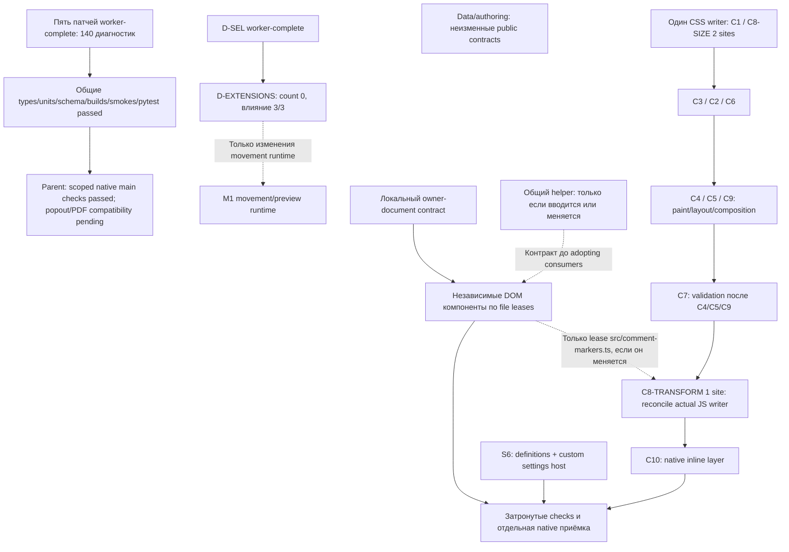

# План исполнения: зависимости, влияние и исполнители

База назначения — `85cb6cd`, снимок [438 мест](lint-remaining-sites.json).
[Машинный план](lint-execution-plan.json) сохраняет каждое исходное место
ровно один раз: **47 jobs, 46 уникальных направленных рёбер, без циклов**,
включая проверку всех условных рёбер. 45 jobs распределяют 438 диагностик;
дополнительные D-EXTENSIONS и P-PDFCOMPAT имеют count 0 и не увеличивают исходный счётчик.
Пять implementation jobs волны 1 имеют статус `worker-complete`, а приёмка
затронутых scoped native/main checks — `integrated-scoped-native-main-checks-passed`.
Popout и PDF compatibility имеют отдельные pending результаты.

Этот документ уточнён по [аудиту интерфейса](lint-workers/interface-dependencies.md)
и [результатам интеграции L19](lint-remediation-checks.md#l19-integrated-evidence-and-remaining-checks-2026-10-06).
Структура плана проверена отдельно от исходников и приложений.

Перед каждым следующим пакетом фиксируются точный участок изменений,
обязательные проверки и единственный владелец затронутых файлов. Во время
проверок приложений используется одна неизменная сборка.

## Текущий результат и счётчики

| Область | База | Текущий checkpoint | Статус свидетельства |
| --- | ---: | ---: | --- |
| src / ESLint | 332 диагностик | 198 warnings, 0 errors | Общая интеграционная проверка L19 |
| CSS | 83 priorities | 83 priorities, 0 :has | CSS в волне 1 не исправлялся |
| Отдельный MCP | 23 диагностик | 17 диагностик | Fresh Node-scoped pass: 15 warnings + 2 intentional errors |
| **Итого** | **438** | **298** | **438 − 140 = 298 = 198 + 83 + 17** |

17 MCP диагностик — 15 warnings и 2 intentional errors отдельного Node-scoped
набора. Это не src warnings и не свидетельство нулевых MCP ошибок. В L19
выполнен свежий whole-MCP diagnostic run; это больше, чем один MCP build.
В ledger остаются все 438 назначений, включая завершённые jobs; статус результата
и текущие live counts хранятся отдельно от исходного количества assigned sites.

Проверка типов, тесты (`1800 passed + 1 skip`), схема, сборки плагина/MCP,
три синтетических сценария и pytest **прошли в общей интеграции L19**.
Все три существующие матрицы прошли на трёх устройствах:
Windows hidden CDP renderer и Android ADB на обоих Samsung. Новый
check-timer-owners.mjs прошёл lifecycle probe с actual plugin private callback,
real native leaf switch/unload/reload, same host и неизменными байтами исходной доски.
Это scoped main/native evidence; Windows input не является OS-window input.

Real PDF view opens/reuses прошли, но private fit fields unsupported на всех
трёх hosts: baseline 85cb6cd и current applyNativePdfFit оба возвращают false,
одинаковый native fallback и две diagnostics. **Automatic PDF fit не считается
успешным.** Timeout/forced reject проверены в actual owner window через
synthetic facade (2000ms, clean); это не реальный native viewer failure.
Popout pending; OS window input не выполнялся. Непроверенные сценарии остаются в очереди отдельно от прошедших.

Текущий immutable main SHA:
`bf411cff362b65d021dc2779e8f72e0411a0ea1d32602e316bf5c71fa6fc7cc0`.
CSS unchanged, SHA
`572acf04c0fc163ebeba19847f34d29441b901756bec23e722164424bb3eff28`.
После freeze код не меняется. Type-only часть имеет byte-identical whole plain plugin
JS (SHA prefix `378f...`); minified AST: 394946 nodes, только 216 identifier
occurrences с consistent bijective renames, без других изменений. Whole MCP
byte-identical (SHA prefix `ed94...`). Полные SHA и область сравнения приведены в реестре L19.

## Степень влияния

Оценка изменения и последствий ошибки различается. У type-only правки может
быть нулевое изменение runtime, но её участок — история и данные доски.

| Уровень изменения | Содержание | Условие приёмки |
| --- | --- | --- |
| 0 | Аннотации/alias/assertion либо обоснование отдельной среды MCP | Идентичный emitted JS и публичные контракты; minifier отдельно |
| 1 | Локальная граница данных или создание DOM | Существующие проверки, документ-владелец, классы/атрибуты/события сохранены |
| 2 | Окна/таймеры, validation, настройки, CSS/геометрия, lifecycle | Поведенческие тесты и затронутые действия в настоящем Obsidian |
| 3 | Пути, совместимость команды, буфер, persistence/сохранение | Дополнительно отказ/stale/locks/source/unknown fields, rollback/history |

Последствия ошибки: 1 — отдельный текст/компонент; 2 — взаимодействие/окно;
3 — данные, история, блокировки, платформа или протокол. D-EXTENSIONS имеет
changeImpact 3 и failureImpact 3 независимо от нулевого количества warnings.

## Владельцы и завершённая волна 1

Назначенное количество — весь участок исходного снимка, а не оставшийся
счётчик или объём первого патча. Владельцы и все исходные inventory indices
сохранены; меняется только job для трёх исходных C8 sites.

| Исполнитель | Назначенный участок | Мест | Волна 1 |
| --- | --- | ---: | --- |
| Sagan — данные | Выделение, records, anchors/metadata/comments, валидаторы вне appearance/main | 90 | D-SEL: 69, worker-complete; D-EXTENSIONS: отдельная очередь, count 0 |
| Helmholtz — авторинг | CanvasAuthoring, адаптер/импорт и viewport records | 65 | A-AUTH: 58, worker-complete |
| Carver — MCP | Самостоятельный сервер, включая scope и config directory | 23 | M-M4: 6, worker-complete; fresh Node-scoped 15 warnings + 2 intentional errors |
| Parfit — платформа | main, PDF host, IDs, fonts, editor/source renderer | 32 | P-TIMERS: 5, worker-complete; scoped native lifecycle passed, auto-PDF-fit unsupported |
| James — основания | appearance, minimap и контракт символов | 5 | F-TYPES: 2, worker-complete |
| Anscombe — интерфейс | DOM/settings/панели/комментарии и весь CSS | 188 | CSS/DOM dependency audit complete; implementation jobs остаются queued |
| Координатор | M1 session, интеграция, общий реестр/сборки/устройства | 35 | Общие gates/scoped native main checks passed; popout/PDF compatibility pending |
| **Всего** | | **438** | **140 снято в пяти implementation jobs; 298 осталось** |

Каждый из пяти завершённых jobs имеет отдельный
`integrationStatus: integrated-scoped-native-main-checks-passed`. Audit — завершённая
read-only работа, а не шестой патч со снятыми warnings. Остальные jobs назначены
в очередь, а не объявлены выполняющимися. Координатор выдаёт узкий scope и
снимает соответствующую file lease перед следующим writer.

## Граф направлений

Диаграмма показывает основные отношения; точные 47 jobs и 46 рёбер находятся
в JSON. Пунктир означает условие, а не универсальную блокировку потребителей.

Нет рёбер «данные → весь UI» или «весь P-CONTEXT → любой DOM».
Действующий owner-document invariant обязателен локально, но не требует сначала
закончить переносимые IDs, font-pack test endpoint и все SourceRenderer fallbacks.
Существующие injected documents позволяют контракт-сохраняющим component patches
идти независимо от type-only data work. Введение нового общего helper/public
contract активирует только соответствующие условные рёбра.

## Реальные зависимости и ограничения параллельности

| Связь | Вид | Правило исполнения |
| --- | --- | --- |
| board-selection → CanvasAuthoring → MCP/M1 | Вызовы кода | Первая волна независима при неизменных контрактах; новая runtime/schema семантика требует согласования затронутых потребителей, а не остановки всего UI |
| Owner-document каждого компонента | Инвариант | Документ берётся у реального board/modal/iframe/Settings владельца; timer set/clear используют одну захваченную среду; сохраняются namespace и test-host fallback |
| Общий DOM или checked-JSON helper → adopting consumer | Условный контракт | Только если helper вводится/меняется и consumer его использует; завершать unrelated sites aggregate job не требуется |
| D-SEL → D-EXTENSIONS → последующее movement runtime | Поведенческая зависимость | Type-only cleanup завершён первым; semantic extension-field repair предшествует дальнейшему изменению переносимых данных/preview, но не блокирует точную замену DOM factories |
| C8-TRANSFORM ↔ CommentMarkers.update | Реальный state writer | CSS translate(0,-100%) конфликтует с inline translate(-50%,-50%); согласовать владельца transform. Если меняется JS, нужна только lease этого компонента и его geometry checks |
| Все CSS jobs | Файл/каскад | Один writer styles.css; ранние размеры C8 отдельно от позднего transform; порядок принимаемых slices не означает логическую зависимость всех селекторов |
| C4/C5/C9 → C7 validation | Проверка результата | Capture должен проверить актуальные paint/layout/rotation; success/Stop/failure восстанавливают camera, flags и обе export roots |
| M1 context/records/DOM/search/text/clipboard/guards | Общий файл | Один writer m1-session.ts; последовательность lease, а не требование сперва мигрировать всю систему типов |
| main timers/leaf/DOM/validator/ID-text | Общий файл | Один writer main.ts; timer patch завершён, дальнейшие leases выдаются отдельно |
| editor-appearance, font-packs, source-renderer | Общие файлы | P-DOM-PROBE/P-DOM, P-CONTEXT/P-DOM и P-CONTEXT/P-RENDER-DATA сериализуются только по реально общим файлам |
| comments-panel, import-guide, search/quick-tools | Общие файлы | U-DOM/U-TEXT, U-DOM/U-RECORDS и U-CONTEXT/U-DOM имеют component leases; read-only trace может идти параллельно |
| MCP jobs с общими board-file/tools-edit/vault/json-rpc | Общие файлы | Assertions, scope review, config/path/dispatch имеют одного writer на общий файл; необходимый Node/stdout код не удаляется ради lint |
| Build → deployment → app input | Проверка | Native matrix относится к одному неизменному build с readback SHA; не менять deployed build во время проверки |

JSON включает sharedFiles у file-lease рёбер. Эти рёбра применяются, когда оба
среза действительно пишут общий файл; они не запрещают read-only scope review.
Когда рёбра имеют несколько причин, дополнительные требования сохраняются в
`additionalRequirements`, а направленное ребро считается один раз.
Условная lease src/comment-markers.ts у C8-TRANSFORM описана отдельно от
безусловного CSS файла. Это конкретная зависимость writer, не общая permission
barrier и не необходимость закрыть все 96 U-DOM warnings.

Можно параллельно исследовать и править независимые компоненты с неизменными
контрактами, заниматься отдельным MCP направлением и проверять Windows/планшет/
телефон на одном неизменном build. Нельзя запускать двух writer одного файла,
делить управление одним Obsidian/device, пересобирать общий output поверх
native matrix или объявлять synthetic input настоящим OS/hardware input.

## Порядок очередей

1. **Волна 1 / worker-complete.** D-SEL 69, A-AUTH 58, M-M4 6,
   P-TIMERS 5, F-TYPES 2. Read-only interface audit завершён. Центральный L19
   и worker before-edit notes существовали до source patches.
2. **Приёмка / parent.** Общие проверки, затронутые native/main матрицы
   и проверки timer lifecycle прошли;
   popout, automatic PDF fit и real native viewer failure остаются отдельными
   pending checks. Этот план ничего не запускает повторно и не выдаёт facade
   timeout/reject за native failure. Rollout выполняется независимо; freeze сохранён.
3. **Независимые направления.** Records/validators, переносимые runtime
   concerns, MCP config/protocol и локальные DOM factories по настоящим
   контрактам/leases. Если вводится общий validator/helper, его точный договор
   предшествует только adopting callers; pure src↔MCP код не импортирует Obsidian.
4. **D-EXTENSIONS / отдельный count 0 job.** Sagan после D-SEL: сохранение
   неизвестных полей при перемещении/смене anchor, без переноса устаревших
   известных attachment fields. Pre-edit trace, preview/commit equivalence,
   chain/group/zoom/one-history-step/native checks обязательны. Последующие
   movement runtime изменения ждут этот repair; type-only и неизменные
   component factories не ждут.
5. **CSS / один writer.** Предпочтительный порядок leases:
   U-C1 → **C8-SIZE (2)** → U-C3 → U-C2 → U-C6 → U-C4 → U-C5 → U-C9
   → **U-C7 validation** → **C8-TRANSFORM (1)** → U-C10.
   U-C1 остаётся пакетом из трёх sites, но dock/primary candidates и
   independent-only native menu требуют своих bounded slices. Для C2/C6/C9/C10
   отдельно проверить реальные native inline writes; высокая specificity
   не побеждает inline style. Не переносить priorities в JS как lint trick.
6. **UI/settings и поздняя совместимость.** Независимые DOM семьи, S6 definitions
   и поиск через custom SettingsTabHost; M1 blocks по одному. Hotkey IDs, системный
   clipboard и native this-wrapper сохраняют compatibility/receiver/history.
   Shared helper contracts условны; S6 не является prerequisite всего CSS.
7. **Приёмка каждого нового среза.** Новый узкий scope, before-edit trace,
   focused tests и соответствующая native matrix на фиксированном build.
   Инвентарь обновляет координатор; baseline assignment ID не исчезает из ledger.
   Новые findings учитываются отдельно от исходных 438.

## Выдача scope и свидетельства

Поручение содержит baseline/rule/sites, owner files, допустимый вид изменения,
callers/actions, before-edit note, focused checks, pending native evidence,
equivalence criterion и запрещённые общие outputs. Работники не правят lint rules
для сокрытия предупреждений, общий реестр/production output и чужие leases.

Windows Obsidian 1.14.4 — isolated profile/CDP без OS input или foreground
takeover согласно текущему parent scope. Renderer synthesis не считается OS
mouse/keyboard свидетельством. SM-X736B/1.13.8 и SM-A336E/1.12.7 — MiroCanvasTest;
ADB input, DOM/CDP preparation/probes и physical hardware stylus записываются
раздельно. Телефон ниже minAppVersion 1.13.7 — дополнительная legacy-проверка,
не доказательство новых S6 API. Scoped main/native результаты записаны как passed по уже предоставленному
parent evidence на immutable build; popout/OS-window/native-failure и
unsupported automatic PDF fit не добавляются к прошедшей матрице.

Для CSS/DOM применяются подробные R1-R11 из interface audit: обе темы, hidden/
disabled/focus, один marquee/outline, native и connector-chain paths до release,
group/mixed selections, 50/125% zoom, commit/Undo/Redo/CANCEL, keyboard/popovers,
real pin hit/tail, iframe ownership, text/layout/rotation/late markup и actual
PDF capture с success/Stop/failure restoration. Системный clipboard и
focus-dependent compositor/popout checks имеют отдельные соответствующие
свидетельства; synthetic ClipboardEvent их не заменяет.

## Findings вне исходных warnings

D-EXTENSIONS присутствует среди 47 jobs как zero-diagnostic semantic job.
Базовые shift(point) и replaced native anchor теряют extension fields;
завершённый type-only D-SEL не выдаётся за устранение этой базовой семантики.
При repair сохраняются unknown fields на всех уровнях, miroSource и исходные
документы; obsolete known attachment fields не копируются слепо.

**P-PDFCOMPAT** — дополнительный platform job, count 0, queued после
P-TIMERS по lease src/obsidian-document-host.ts. Это существующий fallback
issue baseline/current, не новый lint warning или timer regression. Нужен
trace поддерживаемого viewer fit, отдельные actual native compatibility/failure
и popout checks. Любой будущий code patch — отдельный scope после снятия freeze;
документ не правит код и не объявляет automatic PDF fit успешным.

**WELCOME-MAIN-WINDOW-ORDER** находится в follow-up queue с count 0, owner
platform/core coordinator и статусом queued-for-trace. Это возможное поведение
порядка массивов generated welcome board при запуске/reopen main window:
сначала отделить native node/group-array settlement от persistence/data loss
и сопоставить базовую/текущую сборки. Это не новый assigned warning, не
подтверждённый завершённый repair и не дополнительный job в счётчике 47.

## Статическая проверка плана

Все W001–W438 и inventoryIndex 0–437 назначены один раз; каждый индекс совпадает
с diagnosticIndices/count своего job и владельцем. Owner totals остаются
90/65/5/32/35/188/23 = 438. Только три прежних U-C8 sites перераспределены:
C8-SIZE — min-width/min-height, C8-TRANSFORM — transform. D-EXTENSIONS и P-PDFCOMPAT не имеют
inventory indices. Сумма completed wave-1 assignments — 140; оставшаяся — 298.

Проверены уникальность job IDs и направленных рёбер, существование обоих концов,
соответствие file-lease реальным общим файлам и topological sort всего графа,
включая условные рёбра. Получено 47/46; циклов нет. Эти результаты подтверждают
структуру плана и арифметику, а не исполнение новых source/app gates.
